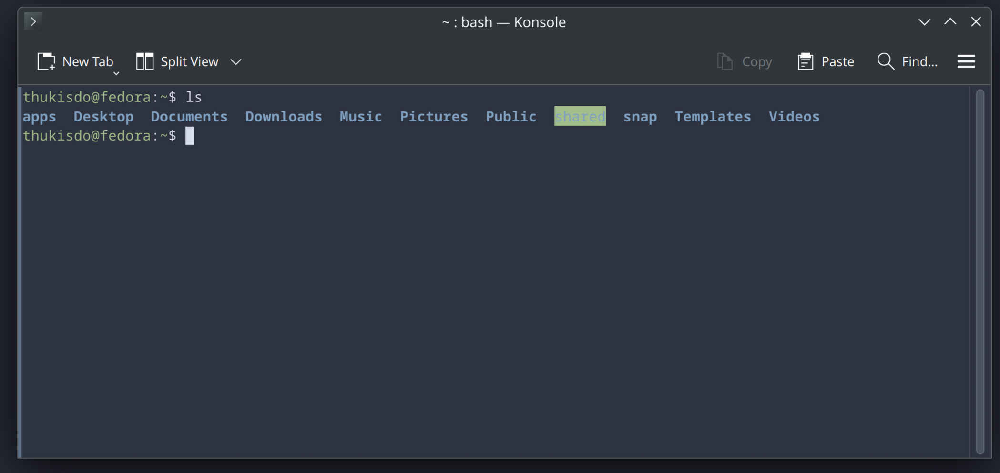
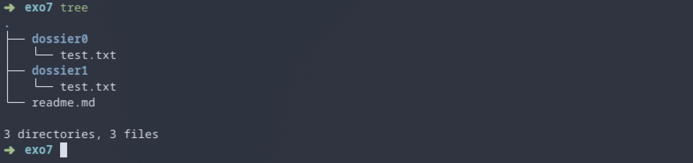
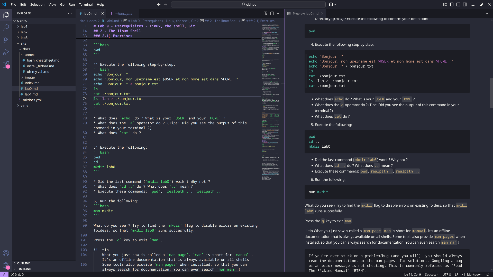

# Lab 0 - Prerequisites - Linux, the shell, Git

## 0 - Linux

[Linux](https://en.wikipedia.org/wiki/Linux) is a family of Operating Systems (like Windows or MacOS) that are suited for programming. Most High-Performance clusters will run a version of linux, and as such **it is mandatory that you learn how to use it.**

If you have a personal laptop, I **highly** recommend you to setup linux on it. Alternatively, you can use [Docker](https://hub.docker.com/_/ubuntu/) or a [virtual machine](https://www.virtualbox.org/) on Windows, but note that this is highly impractical. Lastly, you can setup and use WSL.

!!! tip
    The university may be able to lend laptops while you're on-site, but you likely won't be able to bring them home for assignments.

<div class="optional-section box-section" markdown>

## 1 <span class="toc-title"> (Optional) </span> - Installing Fedora

If you want to install Linux on your personal laptop but aren’t sure where to start, you can follow [these instructions](annex/install_fedora.md).

[**Fedora**](https://getfedora.org/) is a modern, open-source Linux distribution sponsored by Red Hat. It ships with the GNOME 3 desktop environment by default and uses `dnf` as its package manager.

If you're new to Linux and want something clean, modern, and close to industry defaults, Fedora is a great place to start.
If you prefer something that feels a bit closer to Windows, consider using the KDE Plasma or XFCE **spins** of Fedora. KDE Plasma offers a highly customizable and polished desktop, while XFCE is lightweight and simple. Note, however, that KDE can be heavier than GNOME in some configurations, whereas XFCE is generally more resource-friendly.
</div>

## 2 - The linux Shell

On Windows/MacOS, you most likely use the file manager or other graphical interfaces to interact with your computer. On linux however, we use the **Linux Shell** via a terminal/console.



The shell is a very powerful tool that allows you to interact with your computer in many ways. We will only cover the basics in this lab.

First, try starting a new terminal. Look for an app called `terminal`, `console` or even `konsole`. In some OS, `CTRL+ALT+T` will open a new terminal.

- A `terminal` is the graphical application displaying the text.
- A `shell` is the underlying program that interprets and executes commands that you provide. By default, your shell will probably be `bash`, which is one of the most basic shells available. All shells serve the same function, but some come with plugins and other tools to make your life easier.

!!! Warning
    To copy/paste in your terminal you must use `CTRL+SHIFT+C` and `CTRL+SHIFT+V`. Pressing
    `CTRL+C` will KILL (stop) the current command.

    If you press `CTRL+S`, this will put the terminal on hold. Nothing will display anymore. Press `CTRL+Q` to re-enable your terminal

### 2.1) Exercises

We will now dive in the very basics on how to use the shell. Note that the exercices presented here are minimal, and there's much to discover.
Lines starting with a `#` are comments and should not be executed.

1) Try inputing the following commands. What does the `ls` command do ?
```bash
# Don't worry about this yet
cd ~
ls
ls -lh
ls -lah
```

2) Run the following commands **step-by-step** and try to understand what is happening:
```bash
ls
mkdir obhpc
ls
cd ./obhpc
ls
mkdir lab0
cd ./lab0
ls
```
What does `mkdir` do ? `cd` ?

3) Based on the previous question, could you give a definition for the term "Current Working Directory" (CWD) ?
Execute the following to confirm your definition:

```bash
pwd
```

4) Execute the following step-by-step:
```bash
echo "Bonjour !"
echo "Bonjour, mon username est $USER et mon home est dans $HOME !"
echo "Bonjour !" > bonjour.txt
ls
cat ./bonjour.txt
ls -lah > ./bonjour.txt
cat ./bonjour.txt
```

* What does `echo` do ? What is your `USER` and your `HOME` ?
* What does the `>` operator do ? (Tips: Did you see the output of this command in your terminal ?)
* What does `cat` do ?


5) Execute the following:
```bash
pwd
cd ..
mkdir lab0
```

* Did the last command (`mkdir lab0`) work ? Why not ?
* What does `cd ..` do ? What does `..` mean ? 
* Execute these commands: `pwd`, `realpath .`, `realpath ..`

6) Run the following:
```bash
man mkdir
```

What do you see ? Try to find the `mkdir` flag to disable errors on existing folders, so that `mkdir lab0` runs succesfully.

Press the `q` key to exit `man`. 

!!! tip
    What you just saw is called a `man page`. `man` is short for `manual`. It's an offline documentation that is always available on all shells. 
    Some tools also provide `man pages` when installed, so that you can always search for documentation. You can even search `man man` !

    If you're ever stuck on a problem/bug (and you will), you should always read the documentation, or the man pages, for solutions. Googling a bug or an error message is not cheating. This is commonly referred as `Read The F*cking Manual` (RTFM).

7) Run this command:
```bash
cd ~
```
Using your knowledge, you should be able to find out what `~` means.

To complete this exercise, you must:

- Navigate to `obhpc/lab0/`
- Create the following file structure:
```
exo7/
    readme.md # With the text "Bonjour !"
    dossier0/
        test.txt  # With the text "test0"
    dossier1/
        test.txt # With the text "test1"
```

It should look something like this (the `tree` command may not be available on your shell):



8) Finally, run the following from `/obhpc/lab0`

```bash
cp -r ./exo7 ./exo7_copy
```

What does `cp` do ? Why do we use the `-r` flag ?

The `rm` command is used to remove files, while the `rmdir` command is used to delete **empty folders**. In order to delete a folder, and all the files it contains, we must use the `--force` and `--recursive` flags, also known as `rm -rf`.

Try the following:
```
rm -rf ./exo7_copy
```

!!! Danger
    `rm -rf` is definitive: there is no way to recover your files after this. No trashbin. If you delete an important folder, **it is gone forever**. 

    **You should always be very careful when doing this.**

    **Thought experiment**: what would happen if you were to run `rm -rf /`, where `/` is the root of your filesystem ? In modern shells, it will probably show an error, or ask for confirmation, but **yes, this could instantly erase all of your files, including your operating system, and crash your computer.**

### 2.2) Cheatsheet 🐍 

| **Goal**                     | **Command**           | **Variants**                                                                       |
|------------------------------|-----------------------|------------------------------------------------------------------------------------|
| **Create a directory**       | `mkdir <path>`        | `mkdir -p <path>` to ignore errors                                                 |
| **Go inside a directory**    | `cd <path>`           | `cd ..` to go up one level, `cd ~` to go to your home                              |
| **List all files**           | `ls (<path>)`         | `ls -lah (<path>)` for pretty print with human-readable numbers. Show hidden files |
| **Print cwd**                | `pwd`                 |                                                                                    |
| **Convert to absolute path** | `realpath (<path>)`   |                                                                                    |
| **Print text**               | `echo <text>`         | `echo $<VARIABLE>` to print a variable                                             |
| **Redirect output to file**  | `>`                   | Example: `echo "Bonjour" > test.txt`                                               |
| **Print file content**       | `cat <path>`          | For big files: `less <path>`                                                       |
| **Delete a file**            | `rm <path>`           |                                                                                    |
| **Delete a directory**       | `rmdir <path>`        | Delete a non empty directory `rm -rf <path>`                                       |
| **Create empty file**        | `touch <path>`        |                                                                                    |
| **Copy a file**              | `cp <input> <output>` | `cp -r <input> <output>` to copy folders recursively                               |

<div class="goingfurther-section box-section" markdown>

### 2.3) <span class="toc-title"> (Going-Further)</span> Upgrading bash

While powerful, `bash` is a very basic shell. Some shells like `fish` or `oh-my-zsh` come with extensions/plugins that can significantly improve your workflow, with auto-completion, coloring, suggestions and many other.

In the near future, **you will spend a lot of time** in your programming environment. Taking a few hours making it more practical or comfortable is a worthwhile investement.

A minimalist `oh-my-zsh` setup is described [here](annex/oh-my-zsh.md). `fish` is very simple to install and pretty powerful, but I do not recommend it due to some `bash` incompatibilities. 

</div>

<div class="optional-section box-section" markdown>

## 3 - <span class="toc-title"> (Optional) </span> Code Editor (VSCode)

We are now going to see the second most critical tool you will use during the Master, second only to the shell: a code editor. Modern code editors allow you to open source files, images, pdf, or even videos. You use your editor to create programs, and the shell to execute them. 



As a starting point, you should download `VSCode` which will cover most of your needs in the future. Do NOT listen to your obnoxious classmates telling you to "just use vim". They cannot be saved.


### 3.1) Installation:

#### 3.1.1) Direct download

Go to the [VSCode Website](https://code.visualstudio.com/download) and select the option matching your OS. For Fedora, click on the `.rpm` button. 

Then double click on the downloaded `.rpm` file to automatically install `VSCode`. 

You can achieve the same effect using:
```bash
# Replace with the correct file:
sudo dnf install ./code-1.99.3-1744761644.el8.x86_64.rpm
```

#### 3.1.2) Snap install

Snap is a very helpful application to automatically install, update, and manage third-party tools (VSCode, pycharm, Spotify, etc.)

```bash
# For Fedora:
sudo dnf install snap
snap install code
```

### 3.2) Usage

Using your shell navigate to the directory you wish to open in VSCode:


```bash
cd ./obhpc/
code .
```

From there, try creating a file, installing extensions (Python, C++, cmake, etc.) and familiarize yourself with the shortcuts.

!!! tip
    You can also open a terminal directly inside VSCode ! 
    
    The shortcut should be `CTRL+J`, but you can always use the terminal menu.

</div>

## 4 - Getting ready for git

A critical part of programming is called "versionning" or "Version Control System" (VCS). This answers the following questions:

- How can I share my code with my colleagues / classmates / friends / everyone ?
- How can I keep a history of the different versions of my code ? Say `version 1.0`, `v2.0`, `v3.0.1.alpha-prelease`, etc.
- How can multiple people work together on the same project ?

We will dive into git later. For now, do the following:

1) Create a [Github account](https://github.com/signup) if you don't already have one. You may wish to keep this account after the master: you should use your personal email so you won't lose acces to it. You should setup two factor authentication (2FA) ASAP.

!!! Note
    Your github page is your portfolio. Your recruiter may look it up, or you may be able to bring it up during interviews to show projects you worked on previously. 
    
    You should take care of it, and have a few clean projects to show !

2) Follow the [official guide](https://docs.github.com/en/authentication/connecting-to-github-with-ssh/generating-a-new-ssh-key-and-adding-it-to-the-ssh-agent) on how to generate and add an ssh key to your github account.


<div class="summary-section box-section" markdown>

<h2 class="hidden-title"> 5 - Summary</h2>

Upon completing this first lab, you should:

- [x] Have a working programming environment
- [x] Know how to navigate the file system with the shell
- [x] Know how to use basic file operations
- [x] Know how to use VSCode to write and edit files
- [x] Be ready to use git with Github

</div>