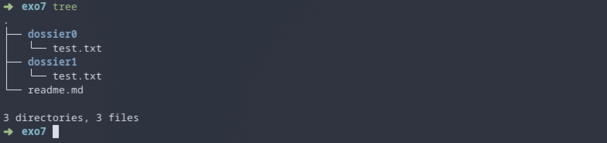

# Lab 1 - Prerequisites - Linux, the shell, Git

<hr class="gradient" />

### Objective

In this lab, you will get familiar with the very basics of using the Linux shell, installing and using a code editor, and setting up git.

The final section of this lab will have you combine all these tools to set up a simple project for a Hello World program in C.

---

## 0 - Linux

[Linux](https://en.wikipedia.org/wiki/Linux) is a family of Operating Systems (like Windows or MacOS) that are suited for programming. Most high-performance clusters will run a version of Linux, and as such **it is mandatory that you learn how to use it.**

If you have a personal laptop, I **highly** recommend you set up Linux (or MacOS) on it. Alternatively, you can use [Docker](https://hub.docker.com/_/ubuntu/) or a [virtual machine](https://www.virtualbox.org/) on Windows, but note that this is highly impractical. Lastly, you can set up and use WSL.

!!! tip
    The university may be able to lend laptops while you're on-site, but you likely won't be able to bring them home for assignments.

<div class="optional-section box-section" markdown>

## 1 <span class="toc-title"> (Optional) </span> - Installing Fedora

If you want to install Linux on your personal laptop but aren’t sure where to start, you can follow [these instructions](annex/install_fedora.md).

[**Fedora**](https://getfedora.org/) is a modern, open-source Linux distribution sponsored by Red Hat. It ships with the GNOME 3 desktop environment by default and uses `dnf` as its package manager.

If you're new to Linux and want something simple to use, Fedora is a great place to start.

</div>

<hr class="gradient" />

## 2 - The linux Shell and Bash

On Windows/MacOS, you most likely use the file manager or other graphical interfaces to interact with your computer. On linux however, we use the **Linux Shell** via a terminal/console.

<figure markdown="span">
  { style="max-width: 80%; height: auto;" }
  <figcaption>The Shell
  </figcaption>
</figure>

The shell is a very powerful tool that allows you to interact with your computer in many ways. We will only cover the basics in this lab.

#### a) First, try starting a new terminal

Look for an app called `terminal`, `console` or even `konsole`. In some linux distribution, `CTRL+ALT+T` will open a new terminal.

- A `terminal` is the graphical application displaying the text.
- A `shell` is the underlying program that interprets and executes commands that you provide. By default, your shell will probably be `bash`, which is one of the most basic shells available. All shells serve the same function, but some come with plugins and other tools to make your life easier.

!!! Warning
    To copy/paste in your terminal you must use `CTRL+SHIFT+C` and `CTRL+SHIFT+V`. Pressing
    `CTRL+C` will KILL (stop) the current command.

    If you press `CTRL+S`, this will put the terminal on hold. Nothing will display anymore. Press `CTRL+Q` to re-enable your terminal

---

### 1. Basic Exercices

We will now dive into the very basics of how to use the shell. Note that the exercises presented here are minimal, and there's much to discover.
Lines starting with a `#` are comments and should not be executed.

#### a) Try inputing the following commands. What does the `ls` command do ?
```bash
# Don't worry about this yet
cd ~
ls
ls -lh
ls -lah
```

#### b) Run the following commands **step-by-step** and try to understand what is happening:
```bash
ls
mkdir glhpc
ls
cd ./glhpc
ls
mkdir lab1
cd ./lab1
ls
```
What does `mkdir` do ? `cd` ?

#### c) Based on the previous question, could you give a definition for the term "Current Working Directory" (CWD) ?
Execute the following to confirm your definition:

```bash
pwd
```

#### d) Execute the following step-by-step:
```bash
echo "Bonjour"
echo "Bonjour, mon username est $USER et mon home est dans $HOME"
echo "Bonjour" > bonjour.txt
ls
cat ./bonjour.txt
ls -lah > ./bonjour.txt
cat ./bonjour.txt
```

* What does `echo` do ? What is your `USER` and your `HOME` ?
* What does the `>` operator do ? (Tips: Did you see the output of this command in your terminal ?)
* What does `cat` do ?


#### e) Execute the following:
```bash
pwd
cd ..
mkdir lab1
```

* Did the last command (`mkdir lab1`) work ? Why not ?
* What does `cd ..` do ? What does `..` mean ? 
* Execute these commands: `pwd`, `realpath .`, `realpath ..`, `realpath ~/glhpc/lab1/..`

#### f) Run the following:
```bash
man mkdir
```

What do you see ? Try to find the `mkdir` flag to disable errors on existing folders, so that `mkdir lab1` runs succesfully.

Press the `q` key to exit `man`. 

!!! tip
    What you just saw is called a `man page`. `man` is short for `manual`. It's an offline documentation that is always available on all shells. 
    Some tools also provide `man pages` when installed, so that you can always search for documentation. You can even search `man man` !

    If you're ever stuck on a problem/bug (and you will), you should always read the documentation, or the man pages, for solutions. Googling a bug or an error message is not cheating. This is commonly referred to as `Read The F*cking Manual` (RTFM).

---

### 2. More Exercises

#### a) Find what `~` is a shortcut for
```bash
cd ~
```

#### b) Create the following file structure using only your terminal:
```
exo7/
    readme.md # With the text "Bonjour"
    dossier0/
        test.txt  # With the text "test0"
    dossier1/
        test.txt # With the text "test1"
```

Where `exo7/`, `dossier0` and `dossier1` are folders/directories.
This directory should be located inside `~/glhpc/lab1/exo7`.

It should look something like this (the `tree` command may not be available on your shell):

<figure markdown="span">
  { style="max-width: 80%; height: auto;" }
  <figcaption>Final output
  </figcaption>
</figure>

#### c) Finally, run the following from `~/glhpc/lab1`

```bash
cp -r ./exo7 ./exo7_copy
```

What does `cp` do ? Why do we use the `-r` flag ?

The `rm` command is used to remove files, while the `rmdir` command is used to delete **empty folders**. In order to delete a folder, and all the files it contains, we must use the `--force` and `--recursive` flags, also known as `rm -rf`.

Try the following:
```bash
rm -rf ./exo7_copy
```

!!! Danger
    `rm -rf` is definitive: there is no way to recover your files after this. No trashbin. If you delete an important folder, **it is gone forever**. 

    **You should always be very careful when doing this.**

    **Thought experiment**: what would happen if you were to run `rm -rf /`, where `/` is the root of your filesystem ? In modern shells, it will probably show an error, or ask for confirmation, but **yes, this could instantly erase all of your files, including your operating system, and crash your computer.**

---

### 3. Cheatsheet 🐍 

| **Goal**                     | **Command**           | **Variants**                                                                       |
|------------------------------|-----------------------|------------------------------------------------------------------------------------|
| **Create a directory**       | `mkdir <path>`        | `mkdir -p <path>` to ignore errors                                                 |
| **Go inside a directory**    | `cd <path>`           | `cd ..` to go up one level, `cd ~` to go to your home                              |
| **List all files**           | `ls (<path>)`         | `ls -lah (<path>)` for pretty print with human-readable numbers. Show hidden files |
| **Print cwd**                | `pwd`                 |                                                                                    |
| **Convert to absolute path** | `realpath (<path>)`   |                                                                                    |
| **Print text**               | `echo <text>`         | `echo $<VARIABLE>` to print a variable                                             |
| **Redirect output to file**  | `>`                   | Example: `echo "Bonjour" > test.txt`                                               |
| **Print file content**       | `cat <path>`          | For big files: `less <path>`                                                       |
| **Delete a file**            | `rm <path>`           |                                                                                    |
| **Delete a directory**       | `rmdir <path>`        | Delete a non empty directory `rm -rf <path>`                                       |
| **Create empty file**        | `touch <path>`        |                                                                                    |
| **Copy a file**              | `cp <input> <output>` | `cp -r <input> <output>` to copy folders recursively                               |

---

<div class="goingfurther-section box-section" markdown>

### 4. <span class="toc-title"> (Going-Further)</span> Upgrading bash

While powerful, `bash` is a very basic shell. Some shells like `fish` or `oh-my-zsh` come with extensions/plugins that can significantly improve your workflow, with auto-completion, coloring, suggestions and many other.

In the near future, **you will spend a lot of time** in your programming environment. Taking a few hours making it more practical or comfortable is a worthwhile investement.

A minimalist `oh-my-zsh` setup is described [here](annex/oh-my-zsh.md). `fish` is very simple to install and pretty powerful, but I do not recommend it due to some `bash` incompatibilities. 

</div>

<hr class="gradient" />

<div class="optional-section box-section" markdown>


## 3 - <span class="toc-title"> (Optional) </span> Code Editor (VSCode)

We are now going to see the second most critical tool you will use during the Master, second only to the shell: a code editor. Modern code editors allow you to open source files, images, pdf, or even videos. You use your editor to create programs, and the shell to execute them. 

<figure markdown="span">
  { style="max-width: 80%; height: auto;" }
  <figcaption>Visual Studio Code (VSCode) Example
  </figcaption>
</figure>

As a starting point, you should download `VSCode` which will cover most of your needs in the future. Do NOT listen to your obnoxious classmates telling you to "just use vim". They cannot be saved.


### 1. Installation:

#### a) Direct download

Go to the [VSCode Website](https://code.visualstudio.com/download) and select the option matching your OS. For Fedora, click on the `.rpm` button. 

Then double click on the downloaded `.rpm` file to automatically install `VSCode`. 

You can achieve the same effect using:
```bash
# Replace with the correct file:
sudo dnf install ./code-1.99.3-1744761644.el8.x86_64.rpm
```

#### b) Snap install

Snap is a very helpful application to automatically install, update, and manage third-party tools (VSCode, pycharm, Spotify, etc.)

```bash
# For Fedora:
sudo dnf install snap
snap install code
```

#### c) Usage

Using your shell navigate to the directory you wish to open in VSCode:


```bash
cd ./glhpc/
code .
```

From there, try creating a file, installing extensions (Python, C++, cmake, etc.) and familiarize yourself with the shortcuts.

!!! tip
    You can also open a terminal directly inside VSCode ! 
    
    The shortcut should be `CTRL+J`, but you can always use the terminal menu.

</div>

<hr class="gradient" />


## 4 - Getting ready for git

A critical part of programming is called "versioning" or "Version Control System" (VCS). This answers the following questions:

- How can I share my code with my colleagues / classmates / friends / everyone ?
- How can I keep a history of the different versions of my code ? Say `version 1.0`, `v2.0`, `v3.0.1.alpha-prelease`, etc.
- How can multiple people work together on the same project ?

We will dive into git later. For now, do the following:

#### a) Create a [Github account](https://github.com/signup) if you don't already have one. 

You may wish to keep this account after the master: you should use your personal email so you won't lose acces to it.

You should setup two factor authentication (2FA) ASAP.

#### b) Follow the [official guide](https://docs.github.com/en/authentication/connecting-to-github-with-ssh/generating-a-new-ssh-key-and-adding-it-to-the-ssh-agent) on how to generate and add an ssh key to your github account.

!!! Note
    Your github page is your portfolio. Your recruiter may look it up, or you may be able to bring it up during interviews to show projects you worked on previously. 
    
    You should take care of it, and have a few clean projects to show !

<hr class="gradient" />

## 5 - First C Project

### 0. Pulling from github Classroom

You will receive a link to GitHub classroom during this lab. Accept the invite and click on your name. This will automatically create a glhpc-lab1 repository on GitHub for you.

First, clone this repository:

```bash
git clone <repo_url> 
```

You should see a simple `Readme.md` and `.gitignore` files inside the newly created folder.

### 1. Creating the project

#### a) Create the following file structure:

```
glhpc-lab1/
    first_c_project/
        build.sh # Empty text file
        src/
            main.c # Empty text file
```

Try to do this only using the shell. If you're using **VSCode** you can `cd` into `first_c_project` and run `code .`
**Make sure to create this structure inside the cloned repo.**


#### b) Modify `main.c` so that it contains:

```c title="main.c"
#include <stdio.h>
#include <stdlib.h>

int main(int argc, char** argv) {
    printf("Hello World !");
    return 0;
}
```

---

### 2. Setup git

Please refer to Lecture 1 for all the git commands you will need in this section.

#### a) Run `git status`, then stage all files from `first_c_project` in git.
#### b) Create a first commit with the message "My first commit"

I recommend you use the command `git commit -m "<message>"` or git may open nano/vim for you to edit the commit message, which may be confusing.

#### c) Ensure the commit worked:

`git log` should display the previous commit, and `git status` should no longer display the content of `first_c_project`. Feel free to commit files from the previous exercises of the lab if you want.

---

### 3. Compiling and running C code

We will now try to run our first program, but before that we need to install a few tools.

#### a) Install GCC

First, we need a *C compiler* to transform the `main.c` file into an executable. We will see in future courses what this does.

For now, install the following packages:

```sh title="Fedora"
sudo dnf install gcc glibc-devel make gdb valgrind
```

```sh title="Ubuntu"
sudo apt update
sudo apt install gcc libc6-dev make gdb valgrind
```

#### b) Check GCC is working

Run the following:

```sh
gcc --version
```
```title="Expected output"
gcc (GCC) 14.3.1 20250808 (Red Hat 14.3.1-3)
Copyright (C) 2024 Free Software Foundation, Inc.
This is free software; see the source for copying conditions.  There is NO
warranty; not even for MERCHANTABILITY or FITNESS FOR A PARTICULAR PURPOSE.
```

#### c) Compiling `main.c`

You can now compile your first program by running

```
gcc src/main.c -o main -g 
```

You should see that a `main` file has been created for you.

#### d) Run main

Run the program by using `./main`

---

### 4. First compilation script

#### a) Create a `build.sh` script that contains the compilation command.

#### b) Try to run `./build.sh`. Does it work ?

Linux uses a concept of **file permissions**: some files can be read, written to, executed, or a mix of the previous.
These permissions are user dependent: you are allowed to read your own files, but this privilege should not extend to other users.

Run the following:

```sh
ls -lah
```

```sh title="Expected output"
-rw-r--r--.  1 user user   0 Aug 26 9:48 build.sh
```

`rw-r--r--` can be read as: 

- The user can Read and Write
- The group can Read
- Others can Read

#### c) Make `build.sh` executable

Run the following:

```sh
chmod +x ./build.sh
```

`chmod` is a command to modify the permissions of a file. `x` designates the eXecution permission, so this command can be read as *add execution permission to build.sh*.

You should see that the file now has permissions `rwxr-xr-x`. This can be read as:

- The user can Read, Write, and eXecute
- The Group can Read and eXecute
- Others can Read and eXecute


#### d) Restrict permissions so that only you (the owner) can read, write, and execute build.sh. Neither the group nor others should have any permissions.

In binary:

- `rwx` = 111 = 7
- `r-x` = 101 = 5
- `r--` = 100 = 4

One can write `chmod 444 ./build.sh` which translates to `r--r--r--` (100 100 100). 

Use this to find the command needed to only give permissions to yourself.

---

### 5. Uploading to GitHub

#### a) Commit all changes you've made so far to git

!!! Tip
    Git is recursive: it doesn't matter whether you run the git commands from `lab1` or `first_c_project`: git knows whether the `cwd` is contained inside a git repository.

#### b) Push on GitHub

The first time you push on the repository, git might:

- Ask you to setup your email/username: Follow git instructions and make sure to use the same as the one you've used on GitHub.
- Set the upstream branch using `--set-upstream`: Follow git instructions

<hr class="gradient" />

<div class="summary-section box-section" markdown>

<h2 class="hidden-title"> 5 - Summary</h2>

Upon completing this first lab, you should:

- [x] Have a working programming environment
- [x] Know how to navigate the file system with the shell
- [x] Know how to use basic file operations
- [x] Know how to use VSCode to write and edit files
- [x] Be ready to use git with Github

</div>