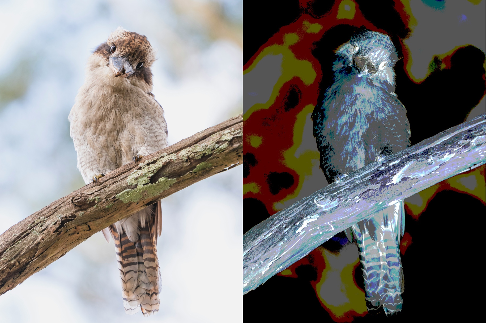

# Lab 2: Performance Aware C Computing

### Objective

You are tasked with implementing an efficient image processing pipeline. A pipeline looks like this:

```text title="Example transformation pipeline"
0 -1 load images/image1.png
1 0 quantize 8
2 1 invert
3 2 save output/image0_transformed.png
```

The line `1 0 quantize 8` declares the node 1, whose parent is the node 0, and performs a quantization transformation with 8 levels. 

!!! Note
    This structure is a Directed Acyclic Graph (DAG), a type of graph often used in data processing and scheduling.


<figure markdown="span">
  
  <figcaption>Example Processing pipeline you will have to implement</figcaption>
</figure>

### Provided Files

The parsing and pipeline execution logic have already been implemented so you can focus on managing memory and kernel implementations. You only need to implement the actual transformations. You are provided with a starter codebase containing the following directories and files:

| Path                | Description                                                                 |
|---------------------|-----------------------------------------------------------------------------|
| `images/`           | Image resources for the lab.                                                |
| `pipelines/`        | Sample transformation pipelines to test your implementation.                |
| `src/`              | C source code for this lab. Contains the files listed below:                |
| `src/main.c`        | Parses the transformation graph and executes it.                            |
| `src/parser.h`      | DAG representation for the image processing pipeline.                       |
| `src/image.c/h`     | Image structure and utilities for memory allocation and management.         |
| `src/stb_image.h`   | Public domain header-only image I/O library (from GitHub).                  |
| `src/transformation.c/h` | Implementation of image processing kernels. Most functions are missing and must be implemented by you. |
| `libparser.so`      | Precompiled dynamic library for pipeline parsing and execution.             |


<hr class="gradient" />

## 1 - Compiling the program

You are provided with the dynamic library `libparser.so`, which contains the parsing and execution logic.

Ensure this library is located at the root of your project, then run:
```sh title="Adding the library to the path"
export LD_LIBRARY_PATH=$(pwd):$LD_LIBRARY_PATH
```

This updates the `LD_LIBRARY_PATH` environment variable to help the kernel locate dynamic library dependencies at runtime. 
Ensure that you run this command everytime you create a new shell for this project.

#### a) First, write a `Makefile` that:

- Compiles `main.c`, `image.c` and `transformation.c` using `gcc`
- Links against `libparser.so`
- Produces a binary named `mystransform`
- Includes a `clean` target that removes compiled artifacts

!!! Danger
    The output binary **must** be named `mystransform`, or later parts of the lab may not work correctly.

#### b) Define a `CFLAGS` variable inside the `Makefile`

To get started, you should use `-Og -g -Wall -Wextra` as compilation flags. We will update this later. Make sure these flags are used when compiling `mytransform`.

#### c) Try running your program

Execute the following:
```sh title="Running a simple pipeline"
./mytransform ./pipelines/test.pipeline
```

```sh title="Expected Output"
Grayscale - Not Implemented
Invert - Not Implemented
Save - Missing function
Quantize - Not Implemented
Save - Missing function
Invert - Not implemented
Save - Missing function
```

This indicates that your build works correctly and you can continue the lab. If needed, fix your `Makefile` until you obtain the same results.

<hr class="gradient" />

## 2 - Allocating & Manipulating memory

Look at `image.c` and `image.h`, and try to understand the provided structure.

- Pixels are stored as `unsigned char* pixels[3]`: what does that mean in practice ? How many arrays do we have to allocate to store an **RGB** Image ? What's the size of each arrray ? What happens if we have a **grayscale** image (black & white).
- How do we distinguish between **grayscale** and **RGB** images ?

### 1) Implement Memory Allocation

#### a) Implement image allocation
You must implement the function `image.c:create_image(...)`.
 
This function should allocate memory buffers big enough to hold an image of size $\text{width} \cdot \text{height}$. Note for this lab, channels can either be 1 (**grayscale**) or 3 (**RGB**).

#### b) Implement image deallocaiton
You must implement `image.c:free_image(...)`.

Make sure you can free both **grayscale** and **RGB** images. **Note**: you must also free the `Image` structure itself.

#### c) Execute the memory implementation test

Compile your program and fix any errors until none are left. Run the following:
```sh title="Memory Test"
./mytransform --memory-test
```

You should get the following:
```sh title="Expected Output"
Memory Allocations tests completed successfully
<Lots of error about copy failure>
```


### 2) Image Copying

#### a) Implement image copy

You must implement `Image* copy_image(const Image* image)` inside `src/image.c`

This functions receives an `Image*`, and produces a **deepcopy**, meaning that we are not copying the pointers, but allocating new pixels buffers and duplicating the image in memory.

You shall not use `memcpy` or `strcpy` for this exercise: perform a manual copy.

#### b) Execute the memory implementation test

Compile again and run:
```sh title="Memory Test"
./mytransform --memory-test
```

You should get the following:
```
Memory Allocations tests completed in 5 seconds
Copy Test: 3000x3000x3 image -> 3524.74 MIOPS, 3.52 GB/s
```

<div class="goingfurther-section box-section" markdown>

#### c) Try different compilation flags
How many GB/s did you get with `-Og` as a compilation flag ? Do you notice a difference with `-O2` ? `-O3` ?

#### d) Implement 2d copy loops

When copying, we have to deal with three dimensions: the channels, the width and the height.

In which order does your current implementation traverse the pixel buffer ?

Implement the following loop structure in C:
```python title="3D loop traversal"
for c in channels
  for x in width
    for y in height
      # Do the copy here
```

!!! Tip
    You should make a copy of your current implementation before implementing this structure, so you can compare the different versions. 
    Optionally, make multiple versions of `copy_image` with different names, and have `copy_image` call the version you want to test.

Now, try swapping out the loop. First iterate on `y`, then `x`, then`c`. Try all possible combinations to find which one is faster. Can you explain why ?

#### e) Implement the linear versions

While images are 3D structures (When taking the channels into account), you may have noticed that we have stored them as 2D arrays (One linear array per channel). 
Each channel is stored in ROW-MAJOR.

- Implement two nested loops: the upper levels iterating on the channels, the inner loop iterating over each pixel.
- Implement one loop: iterate only over the pixel, copying RGB in a single loop.

Compare the performance by running the `--memory-test` option. Which loops give you the best performance ? Do you understand why ?

</div>

<hr class="gradient" />

## 3 - Executing a transformation pipeline 

Look at `src/parser.h` and try to understand the different structures of the parser. Do the same for `src/transformation.c`

### 1) Implementing Grayscale

The grayscale transform receives an RGB image and converts it into a black and white, single channel image.
The formula for the transformation is:

$$
C_{out} = 0.299 \cdot R_{in} + 0.587 \cdot G_{in} + 0.114 \cdot B_{in}
$$

Where C is the grayscale channel, and R,G,B are the corresponding components of the RGB image.
 Note: if the grayscale transform receives a grayscale image as input, it should output a (deep) copy of the input.


#### a) Implement this transformation
You should read data from `node.input`, and **allocate and write data** to `node.output`. 
You do not need to free the `input` and `output` buffer of any of the nodes: it will be handled for you.

Test using
```sh title="Test grayscale"
mkdir -p ./output
./mytransform ./pipelines/test.pipeline
```

At this stage, `output/test_grayscale.png` should contain the grayscale of `images/test.png`


### 2) Implementing Inversion

The inversion transform is a simple one

$$
C_{out} = 255 - C_{in}
$$

Where C is one of the input image channels (RGB or Grayscale). Implement this kernel in `transformation.c:invert_image(...)`.

### 3) Implementing Quantization

We will implement a **uniform quantization** transform, which uniformly reduces the number of possible values in each component of the image.

$$\begin{aligned}
\text{step} &= \frac{255}{\text{levels} - 1} \\\\
C_{out} &= \text{round}\left(\frac{C_{in}}{\text{step}}\right) \cdot \text{step}
\end{aligned}$$

Where $\text{levels}$ is the target number of discrete values per component. This maps each input color channel value $C_{in} \in [0, 255]$ to a quantized output $C_{out}$ in the same range.

#### a) Implement this transformation using the formula provided above.

You must implement this method in `transformation.c:quantize_image_naive(...)`

#### b) Optimize using a lookup table

Division and floating-point operations can be costly. Since $C_{in} \in [0, 255]$, we can easily precompute all possible outputs in a **lookup table (LUT)** of size 256, 
then convert each pixel using:

$$
C_{out} = LUT[C_{in}]
$$

We are trading **memory overhead for performance**, which is a very common pattern.

Implement this method in `transformation.c:quantize_image_lut(...)`, and be sure to correctly allocate and free the LUT.

### c) Compare performance

Modify `transformation.c:quantize_image(...)` to either use the LUT or the naive version, and run the following code:
```title="Benchmarking"
time ./mytransform ./pipelines/quantize_benchmark.pipeline
```

Which version is faster ? What's the speedup of the LUT method over the naive version ?

<hr class="gradient" />

## 4) Validation

At this stage, your code should be able to execute all pipelines in the `pipelines/` directory. 
Validate your implementation by checking that output images are generated and appear visually correct.

### 1) Improving performance

Once your implementation is functionally correct, your next goal is to **optimize performance**.

Use the provided script:

```sh
# run_all.sh <run_label>
./run_all.sh baseline
```

Check the resulting plots in `./results/baseline/`. Take a look at `./results/baseline/pipeline.pipeline` to understand which operations are being evaluated.
Re-run the benchmark after every meaningful optimization, and check `./results/comparisons.png` to see if you improved performance or not. **Tip**: play around with compilation flags.

To remove a version, remove the corresponding folder in `./results`

!!! Important
    You need to have python installed for `run_all.sh` to work. On Fedora:
    ```sh title="Installing python on fedora"
    sudo dnf install python3 python3-pip python3-virtualenv
    ```

<div class="summary-section box-section" markdown>

<h2 class="hidden-title"> 5 - Summary</h2>

Upon completing this second lab, you should know how to:

- [x] Create a makefile, link to a dynamic library.
- [x] Explore compilation flags for performance
- [x] Allocate and free memory in C.
- [x] Explore the effect of memory layout and loop order on performance.
- [x] Implement loop-based algorithms.
- [x] Rearrange your algorithm to avoid costly operations.
- [x] Understand the basics of the optimization loop.

</div>
  

