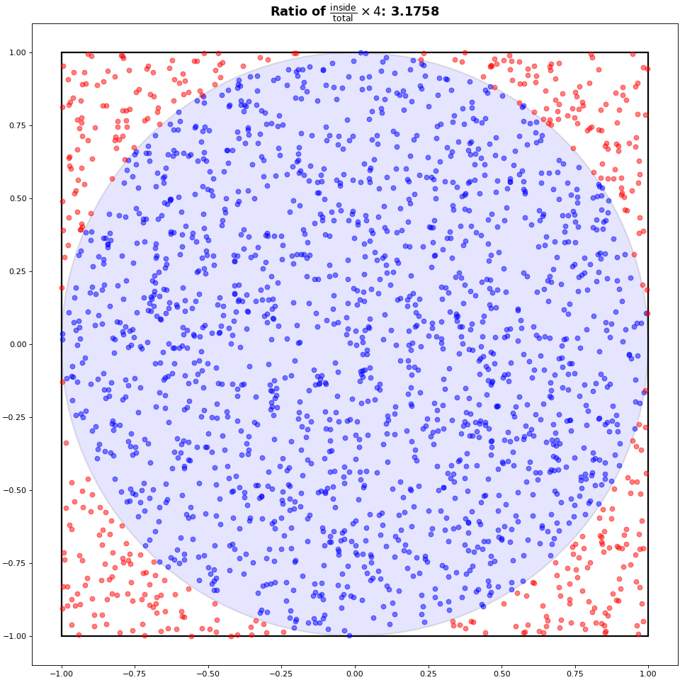

# Lab 3: Mini-Project Pi estimation using Monte-Carlo

In the Monte Carlo method, a result is inferred by introducing randomness into a computation, which is then repeated many times to obtain a statistically meaningful estimate. Monte Carlo methods are especially useful for approximating quantities that are difficult or computationally expensive to determine analytically or through deterministic algorithms. 

In this lab, we explore the approximation of π using Monte Carlo sampling. To do this, we consider a unit circle (radius 1) inscribed within a square of side length 2, centered at the origin. By generating random points uniformly within the square and counting how many fall inside the circle, we can estimate the ratio of the areas of the two shapes. 

Since the area of the circle is $\pi \cdot r^2 = \pi$, and the area of the square is 4, we expect the ratio of points falling inside the circle to converge to $\pi / 4$.

<figure markdown="span">
  
  <figcaption>Monte-Carlo Pi</figcaption>
</figure>

## 1 - Implementing the MC Method

Implement your own version of the $\pi$ estimator inside `src/compute_pi.c` using the Monte-Carlo method. This method receives $n$ the number of Monte-Carlo samples to take as arguments, and must return the approximation of $\pi$ in `double` precision.

Build your program using `make` and validate your implementation. The program can be run using:
```bash
# piestimator <nsamples>
piestimator 1000000
```

## 2 - Timing and serialization

1) Modify the function `src/main.c:mc_harness(...)` to measure the execution time of your method. You must repeat the measurements `nmeta` times, and record the values of Pi as well as the execution time for every execution.

What function did you use to measure time ? What is its resolution ?

2) Modify the function `src/main.c:print_results()` to print a table with the following values:

| Avg. Pi             | Std Pi                   | Avg. Time              | Std Time                             | Min Time           | Max Time           |
|---------------------|--------------------------|------------------------|--------------------------------------|--------------------|--------------------|
| Average Value of Pi | Standard Deviation of Pi | Average execution time | Standard Deviation of execution time | Min execution time | Max Execution time |

You may need to modify other functions or the provided structure(s) to achieve this.

3) Implement csv serialization inside the program. You must exactly match this format:

```csv
NMeta,Pi,Time
1,3.145584,0.025
2,3.13547,0.028
```

Print at least 8 decimals, and save the file in the provided output path.

!!! Danger
    Be sure to respect this format perfectly, or it may cause issues in the following section. Note, there's no space in the header column (`NMeta,Pi` instead of `NMeta,     Pi`).

4) Run and wait for the provided experiments to complete. If you correctly implemented csv serialization, this will generate plots inside the `results` folder.

```sh
./run_all.sh sequential
```

a) First, look at the first figure in `convergence.png`. How do you interpret this graph ? How does the error evolve when increasing the number of Monte-Carlo samples ? If needed, fix your program so that the relative error converges towards zero.

b) Look at the second figure: how does execution time evolve when increasing the number of samples ? If needed, fix your program so that the execution time scales linearly with the number of samples.

c) Look at the first figure in `stability.png`. How are the values of the Pi estimations distributed ? Is there any bias, and if yes, why ? If needed, fix your program so that the Pi estimations are normally distributed around 3.14.

d) Look at the second figure: how is the execution time distributed ?
How important is the measurement noises ? Is your machine stable ? If needed, fix your measurements so that the execution time is mostly normally distributed, and the measurement noise is tolerable.


!!! Tip
    The `results/expected_results` folder contains examples of plots that were run on a stable machine, with a correct implementation of the Monte-Carlo estimator.


<div class="goingfurther-section box-section" markdown>
## 2.5 - <span class="toc-title"> (Going-Further)</span> Understanding the scripts

1) Look at `run_all.sh`, and try to understand each line.

a) What does `set -e`, `set -o pipefail` and `2>&1 | tee ...` do ?

b) Why do we expect a `run_label` argument ? What files are generated, and what's the purpose of every one of them ?

2) Look at `scripts/analyse.py` and try to understand how each plot is built. Try to link every components of `convergence.png` and `stability.png` (The titles, the axis label, the axis ticks, the distributions, the grid, ...) with the code that generates it.


</div>


## 3 - Optimization

1) Modify the `makefile` and play around with compilation flags, and try different compilers. Record all of your results in a simple markdown file. What configuration gives you the fastest execution time ? Can you understand why ?

2) Use OpenMP to parallelize your Monte-Carlo algorithm. You may need to modify the `makefile` to link to OpenMP.

a) Do you see any performans gains ?

b) Rerun the provided experiments, and compare with your previous sequential result.

```bash
./run_all.sh parallel
```

Is your program faster using OpenMP ? If not, ensure you are correctly running multiple threads.

c) Is the performance stable ? Is there any impact on the accuracy of your estimator ?

d) Verify your implementation strong scaling:

```
OMP_NUM_THREADS=1 ./piestimator 1000000
OMP_NUM_THREADS=2 ./piestimator 1000000
OMP_NUM_THREADS=4 ./piestimator 1000000
OMP_NUM_THREADS=8 ./piestimator 1000000
```

e) Verify your implementation weak-scaling:

```
OMP_NUM_THREADS=1 ./piestimator 1000000
OMP_NUM_THREADS=2 ./piestimator 2000000
OMP_NUM_THREADS=4 ./piestimator 4000000
OMP_NUM_THREADS=8 ./piestimator 8000000
```