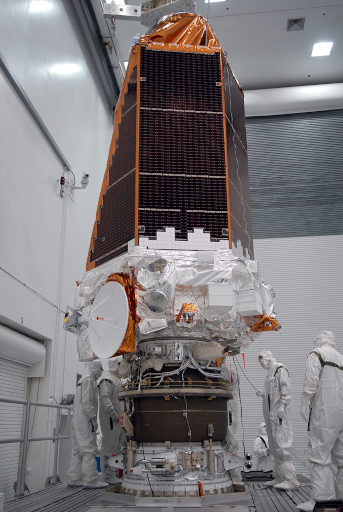
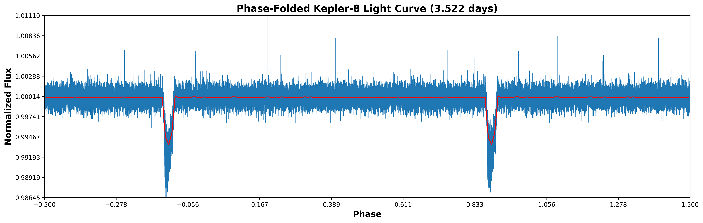
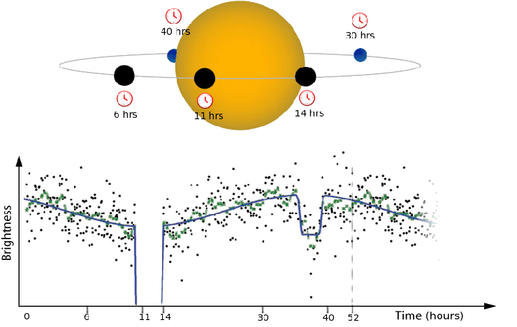
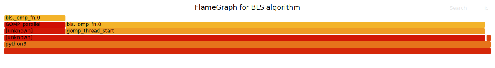

# TD5: Experimental Methodology and Scientific Reporting
<hr class="gradient" />

The [Kepler space telescope](https://en.wikipedia.org/wiki/Kepler_space_telescope) monitors the variation in the luminosity of distant stars using a photometer. The datasets are freely available online, and we will use them as a study case for this lab.


<figure markdown="span">
  
  <figcaption>Kepler space telescope shortly after the assembly
  <br>
  (NASA/Troy Cryder)
  </figcaption>
</figure>

Kepler generates pretty simple datasets: a photon flux (the intensity of the received light) at a certain date for a particular star. However, by carefully preprocessing this data and using dedicated signal analysis techniques, we can make major discoveries.

---

### Provided files

| Path                | Description                                                                 |
|---------------------|-----------------------------------------------------------------------------|
| `data/`             | Pre-processed Kepler dataset for this lab                                   |
| `libbls/`           | Box Least Square (BLS) Python library for transit detection. (CMake)        |
| `scripts/`          | Python/bash scripts for plotting and data analysis                          |
| `src/stability.py`  | Monitors the system usage for 5 minutes to assess measurements stability    |
| `src/strong_scaling.py`      | Draft for a strong scaling analysis you will have to complete      |
| `setup_env.sh`      | Helper script to setup the python environment and various env. variables    |
| `build_library.sh`  | Helper script to run CMake for the BLS library                              |

<hr class="gradient" />

## 1 - Plotting and data analysis

Kepler generates time-series, that is data indexed by a timestep. First, look at the data inside `data/Kepler-8_light_curve.csv`. The `time` column denotes the time in days since the satelite reference. The `flux` column is the normalized measured luminosity of the Kepler 8 star at a given date.

#### a) Setup python

Run the following:
```bash title="Setup bash environment"
source ./setup_env.sh
```

#### b) Plot the evolution of luminosity

Write a `script/plot_luminosity.py` script that:

- Can be called with `./script/plot_luminosity.py ./results kepler-*` where * is an id (i.e., kepler-8, kepler-17, etc.)
- Fetches the corresponding dataset in `data/`
- Plots the dataset using `matplotlib` (x: Time (days), y: Flux)
- Save the plots as `results/luminosity_kepler-*.png`

Make sure that the script is executable using `chmod +x <file>` and that the file starts with the shebang `#!/usr/bin/env python3` 

!!! Tip
    You should make sure that the `results` folder exists before trying to save to it. You can use `os.makedirs(<path>, exists_ok=True)` in your script. Beware that the datasets paths are Capitalized !

#### c) Run the previous script for the Kepler 8 dataset. What do you observe ?
#### d) Refine your previous plot

Make sure that:

- The axis are clearly labelled
- The x and y ticks are easily readable and properly spaced (`np.linspace`)
- The plot has a title, legend, and a `tight` or `constrained` layout.
- The figure format is correct (ratio between width and height)

The final plot should look something like this:


#### e) Give a possible explanation for the periodic dips in luminosity

On the previous light curve, we observe that the luminosity appears to "dip" sharply at regular intervals.
What could cause this periodic phenomenon ?

#### f) Implement phase folding light curve

Phase folding is a simple technique to visualize periodic signals: we fold the data over a given period so that the signals overlaps, highlighting patterns.

```python title="Phase Folding"
# ... Load data here
# Period to fold over
period = 0.8
 # We phase by the period, and divide by period to go in the [0, 1] range
phase = (data["time"] % period) / period
phase = phase - 0.5 # Center the phase
sort_idx = np.argsort(phase)
phase_sorted = phase[sort_idx]
flux_sorted = data["flux"].iloc[sort_idx]

phase = np.concatenate([phase_sorted, phase_sorted+1]) # Double plotting to improve visualization
flux = np.concatenate([flux_sorted, flux_sorted])
```

Implement a `scripts/phase_folding.py` script that plots the phase-folded light curve (x: phase, y: flux). 

It should be used like so:
`./script/phase_folding.py ./results kepler-* <period>`.

Optionnaly, you can also plot a binned mean on top of the phase-folded light curve:

```python title="Phase folding: Binning"
from scipy import stats
bins = 200
bin_means, bin_edges, _ = stats.binned_statistic(phase_sorted, flux_sorted, statistic='mean', bins=bins)
bin_centers = (bin_edges[:-1] + bin_edges[1:]) / 2
ax.plot(bin_centers, bin_means, color="red", lw=1.5)
```

#### h) Check the file `data/Kepler-8_known_planets.json

Run the previous script by phase folding over the Kepler 8b Period. 

- What do you observe ? 
- Does the light "dip" overlaps or is your plot noisy ? 
- What can we say about the relationship between the light "dip" and Kepler 8b orbit ?



<hr class="gradient" />

## 2 - Box Least Square

The Box Least Square (BLS) signal processing algorithm is used to detect the transit of exoplanets in front of their stars by searching for characteristic box-shaped dips in the luminosity at regular frequency.

The provided library implements a Python <-> C interface so that you can call BLS from a python script. It also simplifies the loading and manipulation of the data, which can be done in python, while the C code focuses on the high performance analysis.

#### a) Run the provided `build_library.sh` script
#### b) Write a `script/bls_runner.py` script for kepler data

The BLS library can be used like so:
```python
import bls
# ... Load data here
match = bls.bls(data["time"].values.astype(np.float64), data["flux"].values.astype(np.float64),
    1.0, 4, 250, 0.02, 0.15, 100)
```
BLS is very sensible to the hyperparameters, and as such you **must use the ones provided here**.

Make sure that your script can be called with `script/run_bls.py kepler-*` and that it reports the match found.
Check that the BLS output is coherent for the Kepler 8b exoplanet characteristic.

<figure markdown="span">
  
  <figcaption markdown="span">Principle behind the Kepler exoplanet detection system
  <br>
  Hannah R. Wakeford, Laura C. Mayorga
  <br>
  [Characterizing the Dynamics and Chemistry of Transiting Exoplanets with the Habitable World Observatory (2025)](https://arxiv.org/abs/2506.22839)
  </figcaption>
</figure>

<hr class="gradient" />


## 3 - Profilers for energy and performance characterization

### 1. Measuring Energy

#### a) Disable perf event paranoid

By default, the linux kernel will restrict access to some perf counters to prevent malicious usage.
We can disable these securities by running:

```bash
sudo sh -c 'echo -1 > /proc/sys/kernel/perf_event_paranoid'
```

Run this command now.

#### b) First energy measure

What does the following command do ?
```sh title="Idle Energy Consumption"
perf stat -a -j -e power/energy-pkg/,power/energy-cores/ sleep 60
```

Ensure your machine is mostly idle and execute this command.

#### c) What does `energy-pkg` measure, and what's the unit ? What about the other events ?

Compute your machine idle power consumption: 

$$
P_{idle} = \frac{\text{energy-pkg}_{idle}}{t}
$$

#### b) Measure the BLS algorithm energy consumption

```sh title="Workload Consumption"
time perf stat -r 5 -a -j -e power/energy-pkg/,power/energy-cores/ \
    ./scripts/run_bls.py kepler-8
```

Note that the `-r 5` flag causes `perf` to perform 5 meta-repetitions. The `time` command reports the sum of the timings for all runs.
Compute the effective power and energy consumption of BLS.

$$
P_{effective} = \frac{\mathrm{energy-pkg_{BLS}}}{t_{BLS}} - P_{idle}
$$

---

### 2. Measuring performance metrics

What does the following command do ?
```sh title="Measuring performance"
time perf stat -r 5 -e instructions,cycles,cache-references,cache-misses \
    ./scripts/run_bls.py kepler-8
```

Execute this command and answer the following questions.

#### a) What's the observed variance in the execution time ?
#### b) What's the mean instructions / cycle ?
#### c) Is the application compute or memory intensive ?

Memory intensive application have very low intructions / cycles, and high memory metrics.
Compute intensive applications are vectorized (High intructions / cycles) and threads are fully used.

#### d) What is costlier: running the BLS algorithm, or loading the huge dataset ?

Run the following:
```sh title="Perf Record"
perf record -g -- python3 ./scripts/run_bls.py kepler-8
perf report
```

You can move around the perf report using the arrow keys, and you can press `+` to expand a particular call tree.

How much time is spent in the BLS algorithm ?

What would be more time-efficient for an engineer: optimizing the data loading process, or the BLS algorithm ?

#### e) Build a flamegraph for bls

Run the following
```sh title="Flamegraph"
# Download the flame graph toolsuit
git clone https://github.com/brendangregg/FlameGraph
 # Convert perf output to a flamegraph-readable format
perf script > out.perf

# Preprocess the perf data
./FlameGraph/stackcollapse-perf.pl ../out.perf > out.folded

# Generate a flame graph
./FlameGraph/flamegraph.pl --minwidth 5 \
    --bgcolors="#ffffff" \
    --title "FlameGraph for BLS algorithm" out.folded > flamegraph.svg
```

Look at the generated flamegraph.svg: does the flamegraph match the previous perf result ?

---




!!! Note
    Its unusual to measure a python application with `perf`. We used python for this lab because it was easier to build the data analysis pipeline in python. 
    
    However, the same tools an be used to directly measure a C application, and precisely profile in which functions is the time spent using `perf record` and `perf report`.


## 4 - Report

You are tasked in making a **maximum 3 page report (References not included)**. Your report must use the following structure:

- 1) Environment and context
    - Give details on the machine you used for the experiments: CPU/Memory specifications, compiler version, python version, OS name and version, and any other details that helps characterize your setup.
    - A brief description of the context of BLS, the kepler datasets, etc.
- 2) Kepler result
    - Include both a lightcurve plot and a phase-folding plot for Kepler 8.
    - The BLS algorithm scans through a range of Orbital Periods, and returns pairs of (Power, Period) which allows us to identify candidates 
    exoplanets. The function `bls.bls_periodogram(...)` returns an array containing all pairs, which allows us to build a **Periodogram**.
    Plot a periodogram for Kepler 8, 17, 45 and 785. **You are required to use subplots**. Feel free to lookup "BLS Periodogram" online to get an idea of the target results. Check that the periodograms match the known exoplanets for all these stars.
- 3) Profiling results
    - **If your machine supports RAPL measurement**: Give the approximate energy consumption of the BLS algorithm on the Kepler 8 dataset. 
    - **If your machine does not support RAPL measurement**:
        - State it explicity
        - Try on another machine if able
        - ... OR replace this experiment by a stability assesment of the `run_bls.py` script (Distribution of runtime).
    - Give the perf results for `instructions,cycles,cache-references,cache-misses`
    - Generate a plot using `./scripts/stability.py` and include it in the report.
    - Include the flamegraph
    - Starting with the `./scripts/strong_scaling.py` script as a basis, make a strong scaling plot for the BLS algorithm on the Kepler 8 dataset.

