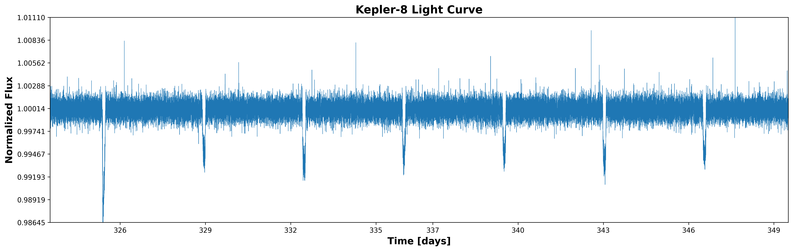

# Lab 5: Experimental Methodology and Scientific Reporting

<hr class="gradient" />

The [Kepler space telescope](https://en.wikipedia.org/wiki/Kepler_space_telescope) monitors the variation in the luminosity of distant stars using a photometer. The datasets are freely available online, and we will use them as a case study for this lab.


<figure markdown="span">
  
  <figcaption>Kepler space telescope shortly after the assembly
  <br>
  (NASA/Troy Cryder)
  </figcaption>
</figure>

Kepler generates relatively simple datasets: a photon flux (the intensity of the received light) at specific dates for a particular stars. However, by carefully preprocessing this data and using specialized signal analysis techniques, we can make major discoveries.


## Report

You should keep all images and results produced during this lab. You should progressively build a report (in markdown, latex, typst or other) following this structure:

- 1) Environment and context
    - Give details on the machine you used for the experiments: CPU/Memory specifications, compiler version, python version, OS name and version, and any other details that helps characterize your setup.
        - You can use `lscpu`, `free -h`, `python --version`, `gcc --version`, ...
    - A brief description of the context of BLS, the kepler datasets, etc.
- 2) Kepler result
    - Include both a lightcurve plot and a phase-folding plot for Kepler 8.
    - The periodogram plot built at the end of this lab.

- 3) Profiling results
    - **If your machine supports RAPL measurement**: Give the approximate energy consumption of the BLS algorithm on the Kepler 8 dataset. 
    - **If your machine does not support RAPL measurement**:
        - State this explicity in your report.
        - Try on another machine if possible
        - ... OR replace this experiment by a weak scaling plot if you can't get RAPL to work.
    - Give the perf results for `instructions,cycles,cache-references,cache-misses` of `bls(...)` on the Kepler-8 dataset.
    - Generate stability plots using `./scripts/stability.py` and include them in the report.
    - Include the flamegraph
    - Include the strong scaling plot

---

### Provided files

| Path                | Description                                                                 |
|---------------------|-----------------------------------------------------------------------------|
| `data/`             | Pre-processed Kepler dataset for this lab                                   |
| `libbls/`           | Box Least Square (BLS) Python library for transit detection. (CMake)        |
| `scripts/`          | Python/bash scripts for plotting and data analysis                          |
| `scripts/stability.py`  | Monitors the system usage for 5 minutes to assess measurements stability    |
| `scripts/strong_scaling.py`      | Draft for a strong scaling analysis you will have to complete      |
| `setup_env.sh`      | Helper script to setup the python environment and various env. variables    |
| `build_library.sh`  | Helper script to run CMake for the BLS library                              |

<hr class="gradient" />

## 1 - Plotting and data analysis

Kepler generates time-series, that is data indexed by a timestep. First, look at the data inside `data/Kepler-8_light_curve.csv`. The `time` column denotes the time in days since the satellite reference. The `flux` column is the normalized measured luminosity of the Kepler 8 star at a given date.

#### a) Setup python

Run the following:
```bash title="Setup bash environment"
source ./setup_env.sh
```

#### b) Plot the evolution of luminosity

Write a `scripts/plot_luminosity.py` script that:

- Can be called with `./scripts/plot_luminosity.py ./results kepler-*` where * is an id (i.e., kepler-8, kepler-17, etc.)
- Fetches the corresponding dataset in `data/`
- Plots the dataset using `matplotlib` (x: Time (days), y: Flux)
- Save the plots as `results/luminosity_kepler-*.png`

Ensure the script is executable using `chmod +x <file>` and that the file starts with the shebang `#!/usr/bin/env python3` 

!!! Tip
    Ensure that the `results` folder exists before saving to it. You can use `os.makedirs(<path>, exists_ok=True)` in your script.

#### c) Run the previous script for the Kepler 8 dataset. What do you observe ?
#### d) Refine your previous plot

Make sure that:

- The axes are clearly labeled
- The x and y ticks are easily readable and properly spaced (`np.linspace`)
- The plot includes a title, legend, and uses a `tight` or `constrained` layout.
- The figure has an appropriate aspect ratio (width to height)

The final plot should look something like this:

<figure markdown="span">
  { style="max-width: 80%; height: auto;" }
  <figcaption>Kepler 8 Light curve
  </figcaption>
</figure>

#### e) Give a possible explanation for the periodic dips in luminosity

On the previous light curve, we observe that the luminosity appears to "dip" sharply at regular intervals.
What could cause this periodic phenomenon ?

#### f) Implement phase folding light curve

Phase folding is a simple technique to visualize periodic signals: we fold the data over a given period so that the signals overlap, highlighting patterns.

```python title="Phase Folding"
# ... Load data here
# Period to fold over
period = 0.8
 # We phase by the period, and divide by period to go in the [0, 1] range
phase = (data["time"] % period) / period
phase = phase - 0.5 # Center the phase
sort_idx = np.argsort(phase)
phase_sorted = phase[sort_idx]
flux_sorted = data["flux"].iloc[sort_idx]

phase = np.concatenate([phase_sorted, phase_sorted+1]) # Double plotting to improve visualization
flux = np.concatenate([flux_sorted, flux_sorted])
```

Implement a `scripts/phase_folding.py` script that plots the phase-folded light curve (x: phase, y: flux). 

It should be used like so:
`./scripts/phase_folding.py ./results kepler-* <period>`.

Optionally, you can also plot a binned mean on top of the phase-folded light curve:

```python title="Phase folding: Binning"
from scipy import stats
bins = 200
bin_means, bin_edges, _ = stats.binned_statistic(phase_sorted, flux_sorted, statistic='mean', bins=bins)
bin_centers = (bin_edges[:-1] + bin_edges[1:]) / 2
ax.plot(bin_centers, bin_means, color="red", lw=1.5)
```

#### h) Check the file `data/kepler-8_known_planets.json`

Run the previous script by phase folding over the Kepler 8b Period. 

- What do you observe ? 
- Does the light "dip" overlap or is your plot noisy?
- What can we say about the relationship between the light "dip" and Kepler 8b orbit ?

<figure markdown="span">
  { style="max-width: 80%; height: auto;" }
  <figcaption>Phase folded Kepler 8 Light curve
  </figcaption>
</figure>

<hr class="gradient" />

## 2 - Box Least Square

The Box Least Square (BLS) signal processing algorithm is used to detect the transit of exoplanets in front of their stars by searching for characteristic box-shaped dips in the luminosity at regular frequency.

The provided library implements a Python <-> C interface so that you can call BLS from a Python script. It also simplifies the loading and manipulation of the data, which can be done in Python, while the C code focuses on high-performance analysis.

#### a) Run the provided `build_library.sh` script
#### b) Write a `scripts/run_bls.py` script for kepler data

The BLS library can be used like so:
```python title="run_bls.py"
import bls
# ... Load data here
match = bls.bls(data["time"].values.astype(np.float64), data["flux"].values.astype(np.float64),
    1.0, 4, 250, 0.02, 0.15, 100)
```
BLS is very sensitive to the hyperparameters, so you **must use the ones provided here**.

Ensure that your script can be called with `scripts/run_bls.py kepler-*` and that it reports the match found.
Check that the BLS output is consistent with the characteristics of the Kepler 8b exoplanet.

<figure markdown="span">
  { style="max-width: 80%; height: auto;" }
  <figcaption markdown="span">Principle behind the Kepler exoplanet detection system
  <br>
  Hannah R. Wakeford, Laura C. Mayorga
  <br>
  [Characterizing the Dynamics and Chemistry of Transiting Exoplanets with the Habitable World Observatory (2025)](https://arxiv.org/abs/2506.22839)
  </figcaption>
</figure>

<hr class="gradient" />

## 3 - Profiling for energy and performance characterization

### 1. Measuring Energy

#### a) Disable perf event paranoid

By default, the Linux kernel restricts access to some perf counters to prevent malicious usage.
You can disable these restrictions by running:

```bash title="Perf event paranoid"
sudo sh -c 'echo -1 > /proc/sys/kernel/perf_event_paranoid'
```

Run this command now.

#### b) First energy measure

What does the following command do ?
```sh title="Idle Energy Consumption"
perf stat -a -j -e power/energy-pkg/,power/energy-cores/ sleep 60
```

Ensure your machine is mostly idle and execute this command.

#### c) What does `energy-pkg` measure, and what's the unit ? What about the other events ?

Compute your machine idle power consumption: 

$$
P_{idle} = \frac{\text{energy-pkg}_{idle}}{t}
$$

#### b) Measure the BLS algorithm energy consumption

```sh title="Workload Consumption"
time perf stat -r 5 -a -j -e power/energy-pkg/,power/energy-cores/ \
    ./scripts/run_bls.py kepler-8
```

Note that the `-r 5` flag causes `perf` to perform five repetitions. The `time` command reports the sum of the timings for all runs.
Calculate the effective power and energy consumption for BLS.

$$
P_{effective} = \frac{\mathrm{energy-pkg_{BLS}}}{t_{BLS}} - P_{idle}
$$

---

### 2. Measuring performance metrics

What does the following command do ?
```sh title="Measuring performance"
time perf stat -r 5 -e instructions,cycles,cache-references,cache-misses \
    ./scripts/run_bls.py kepler-8
```

Execute this command and answer the following questions.

#### a) What's the observed variance in the execution time ?
#### b) What's the mean instructions / cycle ?
#### c) Is the application compute or memory intensive ?

In summary:

- Memory-intensive applications have low instructions per cycle and high memory metrics
- Compute-intensive applications are vectorized (high instructions per cycle) and fully utilize threads.
  Memory usage is relatively low because the arithmetic density is high.

#### d) What is costlier: running the BLS algorithm, or loading the dataset ?

Run the following:
```sh title="Perf Record"
perf record -g -- python3 ./scripts/run_bls.py kepler-8
perf report
```

You can move around the perf report using the arrow keys, and you can press `+` to expand a particular call tree.

How much time is spent in the BLS algorithm ?

Which would be more time-efficient for an engineer: optimizing the data loading process or optimizing the BLS algorithm?

#### e) Build a flamegraph for bls

Run the following commands
```sh title="Flamegraph"
# Download the Flamegraph tool suite
git clone https://github.com/brendangregg/FlameGraph
# Convert perf output to a flamegraph-readable format
perf script > out.perf

# Preprocess the perf data
./FlameGraph/stackcollapse-perf.pl ./out.perf > out.folded

# Generate a flame graph
./FlameGraph/flamegraph.pl --minwidth 5 \
    --bgcolors="#ffffff" \
    --title "FlameGraph for BLS algorithm" out.folded > flamegraph.svg
```

Examine the generated `flamegraph.svg`. Does the flamegraph match the previous perf results?

---

<figure markdown="span">
  { style="max-width: 100%; height: auto;" }
  <figcaption>FlameGraph Example
  </figcaption>
</figure>

!!! Note
    Its unusual to measure a python application with `perf`. We used python for this lab because it was easier to build the data analysis pipeline in python. 
    
    However, the same tools can be used to directly measure a C application, and precisely profile in which functions is the time spent using `perf record` and `perf report`.

### 3. Strong scaling analysis

Take a look at `scripts/strong_scaling.py`. It contains a code snippet for running the `scripts/run_bls.py` script with a given number of threads. Our goal is now to build a strong scaling plot.

#### a) Look and try to understand the purpose of the `scripts/stability.py` script

What are we measuring ? What information does this script provide about our environment?

#### b) Modify `stability.py` to measure the stability of `run_bls.py`

To further assess the stability of our setup, we should try to measure the distribution of multiple runs of `run_bls.py`

Modify the script to:

- Load the kepler 8 Dataset, and subsample it (Reduce the size to ~2k randomly selected samples)
    - Be sure to sort the dataset after subsampling by using `df.sort_values(by="time")` !
- Save the previous dataset, and execute `run_bls.py` on the subsampled dataset, measuring the time.
- Repeat the previous measurements approximately 100 times, and generate a distribution plot using seaborn.
    You can use a boxplot, kdeplot, violin plot, histogram, etc.
    Save the raw data to `results/stability_bls.csv`

If your machine is stable, the performance distribution should follow a normal distribution.

---

<figure markdown="span">
  { style="max-width: 60%; height: auto;" }
  <figcaption>Examples of different distribution plots.
  <br>
  The stability results here were gathered on a laptop that was in-use, thus the measures are quite unstable.
  </figcaption>
</figure>

---

#### c) Modify `scripts/strong_scaling.py` to build a strong scaling plot

Save the plot to `results/<date>/strong_scaling.png` where date is obtained via:
```python title="Formatting a timestamp"
import time
date = time.strftime("%Y_%m_%d-%H_%M_%S") # e.g. 2025_08_28-12_08_40
os.makedirs(f"results/{date}/", exist_ok=True)
```

#### d) Build a periodogram

The BLS algorithm scans through a range of Orbital Periods, and computes a *Power* score for each candidates. The higher the power, the better the candidate. 

The function `bls.bls_periodogram(...)` returns a 2D array containing all the scores, which allows us to build a **Periodogram**. Pairs are stored as (Power, Period).

- Take a look at `scripts/periodogram.py` and understand the provided code snippets
- Plot a periodogram for Kepler 8, 17, 45 and 785. **You are required to use subplots** so that all periodograms are on the same figure. Feel free to lookup "BLS Periodogram" online to get an idea of the target results.
- Note that you should use the same arguments for `bls.bls_periodogram(...)` that the ones used for `bls.bls(...)` earlier in the lab.

<hr class="gradient" />

<div class="summary-section box-section" markdown>

<h2 class="hidden-title"> 5 - Summary</h2>

Upon completing this fifth lab, you should know how to:

- [x] Build simple plots using python and matplotlib
- [x] Improve a plot with titles, labels, formatting
- [x] Manipulate simple data formats (csv, json)
- [x] Use `perf` for measuring energy and performance hardware counters
- [x] Use `perf` sampling profiler to understand an application hotspots
- [x] Organise a report around data analysis

</div>