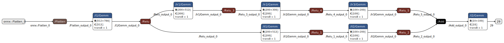

# Lab 7: Projet IA - Part 2 - Neural Networks Inference Engine

In [lab 6](lab6.md), you implemented and optimized an sgemm library for matrix-matrix multiplication. In this lab, you will use this library to implement a simple neural network inference engine. This lab is inspired by [Michal Pitr inference engine project](https://github.com/MichalPitr/inference_engine/) released under the MIT license. Michal Pitr offers a C++ implementation and a series of [excellent blog posts](https://michalpitr.substack.com/p/build-your-own-inference-engine-from) explaining the implementation. Feel free to read them, but you must implement the lab in C and produce your own code.

## 1 - Design of the inference engine

We want to recognize handwritten digits from the MNIST dataset using a neural network. The neural network has been trained using [PyTorch](https://pytorch.org/) and the [ONNX format](https://onnx.ai/) is used to export the model.

The model takes as input a 28x28 grayscale image (784 pixels) and outputs a vector of 10 probabilities, one for each digit (0 to 9). The predicted digit is the one with the highest probability.

The model architecture is described as a computation graph. Each node in the graph represents a layer in the neural network. The edges represent the flow of data between layers.
Our inference engine must support the following four operations:

- **Flatten**: This layer reshapes the input tensor into a 2D matrix. The 28x28 image is flattened into a 784x1 vector.
- **Add**: This layer performs element-wise addition of two matrices. The operation can be expressed as `Y = A + B`, where `A` and `B` are the input matrices.
- **Gemm**: This is a fully connected layer. It performs a linear transformation of the input data using weights and biases. The operation can be expressed as `Y =  A * B + C`, where `A` is the input matrix, `B` is the weight matrix, `C` is the bias vector, and `alpha` and `beta` are scaling factors.
- **Relu**: This layer applies the ReLU (Rectified Linear Unit) activation function, which sets all negative values to zero. The operation can be expressed as `Y = max(0, X)`, where `X` is the input matrix.

Multiple pre-trained models are available in the `models/` directory. They differ by their architecture (number and type of layers and number of neurons per layer). You can use the web application [Netron](https://netron.app/) to visualize the models.

Your inference engine must be able to execute any of these models. It should be as efficient as possible. You have already optimized the sgemm library in the previous lab.
Now you must implement and optimize the other operations (add, relu, flatten) and the overall scheduling of the model.

## 2 - Projet structure

Here are the contents of the project starting directory:

- `models/`: Directory containing pre-trained ONNX models.

- `image-test-set/`: Directory containing test images in binary format.

    - `image_0.ubyte` to `image_99.ubyte`: 100 test images of handwritten digits in binary format; extracted from the [MNIST](https://en.wikipedia.org/wiki/MNIST_database) database. Each file contains 784 bytes (28x28 pixels) representing a grayscale image.

    - `labels.csv`: Text file containing the expected labels for the test images separated by commas. Each value corresponds to the label of the image with the same index (e.g., the first label is the label for image_0.ubyte).

- `external/onnx/`: Directory containing an ONNX protobuf low-level parser. We use this auto-generated parser to read the ONNX format. You don't need to modify anything in this directory.

- `src/`: Directory containing the source code.

    - `main.c`: Minimal main program.

    - `parse_model.h` and `parse_model.c`: High level code for parsing input images and ONNX models.

- `tests/`: Directory containing unit tests for `parse_model.c`.

- `CMakeLists.txt`: CMake build configuration file.

## 3 - The parse_model module

The parse_model module provides utilities to load MNIST input images and read ONNX models, exposing a small C API to access model graph info and weight tensors.

### Data types

- `struct matrix_t`: represents a matrix (weights or data) with fields:

    - `bool weights`, true if the `matrix` represents weights, false for data. 
    - `size_t M, N`, dimensions of the matrix (`MxN`).
    - `float *data`, pointer to the matrix data in row-major order.

- `struct model_t`: opaque model handle (internal representation hidden).

- The caller is responsible for freeing returned objects using `free_matrix()` and `free_model()`.

### Core functions

- `struct matrix_t* read_mnist_input(char *filename)`: load a 28×28 MNIST image as a 784×1 matrix.
- `void free_matrix(struct matrix_t *m)`: free `a matrix_t`.
- `struct model_t* read_onnx_model(const char *filename)`: parse an ONNX file and return a model handle.
- `void free_model(struct model_t *model)`: free the model handle.
- `struct matrix_t* get_weight_matrix(struct model_t *model, char *name)`: retrieve an initializer (weight/bias) by name.

### Graph inspection helpers

- `char * get_graph_input_name(struct model_t *model)`: graph input name.
- `char * get_graph_output_name(struct model_t *model)`: graph output name.
- `size_t get_number_nodes(struct model_t *model)`: number of nodes in the graph.
- `char * get_node_name(struct model_t *model, size_t node_pos)`: node name.
- `char * get_op_type(struct model_t *model, size_t node_pos)`: node operator type (e.g. "Gemm", "Relu", "Add", or "Flatten").
- `char * get_output_name(struct model_t *model, size_t node_pos)`: node output name.
- `size_t get_number_inputs(struct model_t *model, size_t node_pos)`: number of inputs for a node.
- `char * get_input_name(struct model_t *model, size_t node_pos, size_t input_pos)`: name of a node input.

### Example _(Click on the image to see it in full size)_

For the model `models/mnist.onnx`,

- `get_number_nodes(model)` returns `15`.

- The first node is a Flatten layer named "/Flatten", 

  - `get_node_name(model, 0)` returns `"/Flatten"` and `get_op_type(model, 0)` returns `"Flatten"`. 

  - Flatten has one input : `get_number_inputs(model, 0)` returns `1`.

    - The input comes from the graph input named `"onnx::Flatten_0"`: `get_input_name(model, 0, 0)` returns `"onnx::Flatten_0"`.

  - Flatten has one output. In our models all layers have a single output, but it can be consumed by multiple nodes (as is the case for the first /Relu layer in our example).

    - The output of the Flatten layer is named `"/Flatten_output_0"`: `get_output_name(model, 0)` returns `"/Flatten_output_0"`.

- The second node is a fully connected layer named "/l1/Gemm",

    - `get_node_name(model, 1)` returns `"/l1/Gemm"` and `get_op_type(model, 1)` returns `"Gemm"`.

    - Gemm has three inputs (the input data, the weights, and the biases): `get_number_inputs(model, 1)` returns `3`.

        - The first input comes from the output of the previous Flatten layer: `get_input_name(model, 1, 0)` returns `"/Flatten_output_0"`.

        - The second input is the weight matrix named `"l1.weight"`: `get_input_name(model, 1, 1)` returns `"l1.weight"`.

        - The third input is the bias vector named `"l1.bias"`: `get_input_name(model, 1, 2)` returns `"l1.bias"`.

      - The output of the Gemm layer is named `"/l1/Gemm_output_0"`: `get_output_name(model, 1)` returns `"/l1/Gemm_output_0"`.

!!! Note
    In the provided ONNX models weight matrices are stored in column-major order. 
    The `get_weight_matrix()` function takes care of this for you by transposing the data and returning a `matrix_t` structure in row-major order.

    We can avoid this transposition by changing the sgemm library to support column-major order in the second matrix, but this is not required for this project.

## 4 - Implementation tasks

### 1. Implementing the four layer operations

Implement functions to execute the four operations (Flatten, Add, Gemm, Relu) using the `matrix_t` data structure. You should create a new source file (e.g., `inference.c`).

Some hints:

- Flatten is straightforward: it just reshapes the input matrix. You can create a new `matrix_t` with the appropriate dimensions and copy the data.

- Add and Relu can be implemented using simple loops. You can optimize them using techniques like loop unrolling or SIMD intrinsics.

- For Gemm, you can use the optimized sgemm library you implemented in the previous lab. You should copy the relevant files and modify the CMakeLists.txt to build and link against the sgemm library.

!!! Tip
    Make sure to add relevant unit tests for each operation in the `tests/` directory.

### 2. Implementing a scheduler for the model graph

Implement a function to execute the model graph. The function should take a `model_t` and an input `matrix_t`, and return the output `matrix_t`.

You can use the graph inspection helpers to traverse the graph and execute each node. You will need to maintain a mapping from node output names to `matrix_t` objects to keep track of intermediate results.

The order of execution must respect the dependencies between nodes. Thus you need to ensure that the execution follows a topological order.

!!! Tip
    Include tests for the scheduler in the `tests/` directory.

### 3. Testing and benchmarking

Use the provided test images and labels to validate your implementation. Include tests in the `tests/` directory to verify the correctness of each operation and the overall model execution.

Measure the accuracy of each model by comparing the predicted labels with the expected labels from `labels.txt`. Report the accuracy for each model.

!!! Note
    To compute a simple accuracy metric, you can count the number of correct predictions and divide by the total number of images.
    More advanced metrics (precision, recall, F1-score) are not required for this lab.

You can use the `main.c` file to implement a simple command-line interface to load a model, load an input image, execute the model, and print the predicted label.

### 4. Optimization and performance analysis

Optimize the implementation for performance and energy efficiency. You can
experiment with parallel execution of the graph nodes, pipelining, and other
optimization techniques.
o
Benchmark the execution time and energy consumption of your implementation. Include your benchmarking scripts in a `performance/` directory.

!!! Tip
    Keep the performance measurements for each version of your code so you can compare them in the final report.
    Do not forget to track versions with git commits.

    The project is open-ended and there are many possible approaches to implement and optimize the inference engine. The goal is to learn about neural networks, ONNX format, and performance optimization techniques. Feel free to explore and experiment with different ideas. If you have access to a GPU, you can also try to implement parts of the inference engine using CUDA or OpenCL.

## 5 - Submission

Submit your implementation in GitHub Classroom. Make sure to include a `README.md` file with instructions on how to build and run your code, as well as any dependencies required.

Include a report (in PDF format, `Report.pdf`) describing your implementation, the optimizations you applied, and the performance results you obtained. Be sure to include the graphs and analysis of the SGEMM optimizations from the previous lab as well. The report should be around 3000 words (about 5 pages in 11pt without figures, tables and code excerpts).