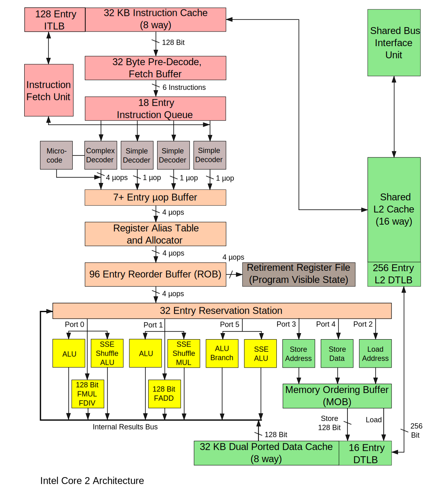

# Introduction to Software Engineering for HPC and AI

<div class="mkdocs-only" markdown>
  <p align="right" markdown>
  [Download as slides 📥](slides/lecture1.pdf)
  </p>
</div>

## Syllabus

- **Lecture 1**: Introduction & Development Environment
- **Lecture 2**: Mastering C for Performance and HPC
- **Lecture 3**: Building, Testing and Debugging Scientific Software
- **Lecture 4**: Experimental Design, Profiling and Performance/Energy Optimization
- **Lecture 5**: HPC for AI

*Project*: Inference Engine for a Deep Network

## Introduction & Development Environment

- Principles of **software engineering applied to HPC and AI**.
- Introduction to **computing architectures**.
- **Development tools**: shell scripts, package management, Git, IDEs, etc.

## Analytical solution to the 2-Body Problem

Consider two particles with masses $m_1$ and $m_2$ at positions $x_1$ and $x_2$ under gravitational interaction.

$$m_1.a_1 = -\frac{G.m_1.m_2}{\|x_1 - x_2\|^3} (x_2 - x_1)$$

$$m_2.a_2 = -\frac{G.m_1.m_2}{\|x_1 - x_2\|^3} (x_1 - x_2)$$

Solved by Bernoulli in 1734, $x_1$ and $x_2$ can be expressed as simple equations that depend on time, masses, and initial conditions.

## Why Simulate the n-Body Problem?

- For $n=3$ or more, no practical analytical solution exists.
- Even advanced mathematical solutions (e.g., Sundman, 1909) are too slow for real use.
- **Computer simulations** allow us to study the motion of many interacting particles.
  - Efficient algorithms (e.g., Barnes-Hut, Fast Multipole) make large-scale simulations possible.
- **HPC is essential** to simulate realistic systems in physics, astronomy, and AI.
  - Simulation + HPC = understanding complex systems!

## Naive n-Body Simulation in C

```c
// Compute accelerations based on gravitational forces
for (int i = 0; i < num_particles; i++) {
  double ax = 0.0, ay = 0.0, az = 0.0;
  for (int j = 0; j < num_particles; j++) {
    if (i == j) continue;
    double dx = p[j].x - p[i].x;
    double dy = p[j].y - p[i].y;
    double dz = p[j].z - p[i].z;
    double d_sq = dx * dx + dy * dy + dz * dz;
    double d = sqrt(d_sq);
    double f = G * p[i].m * p[j].m / (d_sq * d);
    ax += f * dx / p[i].m;
    ay += f * dy / p[i].m;
    az += f * dz / p[i].m;
  }
  p[i].ax = ax;
  p[i].ay = ay;
  p[i].az = az;
}
```

## Naive n-Body Simulation in C

Introduce a time step `dt` and update positions based on gravitational forces.

```c
// Update positions based on computed accelerations
for (int i = 0; i < num_particles; i++) {
  p[i].x += p[i].ax * dt * dt;
  p[i].y += p[i].ay * dt * dt;
  p[i].z += p[i].az * dt * dt;
}
```

## High Performance Computing

**Fugaku (2020, 442 petaflops, 7.3 million cores)**

  - n-body: integrates **1.45 trillion** particules per second.

**How to achieve such performance?**

- Algorithmic improvements:
  - Use tree-based methods (Barnes-Hut) to reduce complexity from $O(n^2)$ to $O(n \log n)$ or better.
- Parallelization: distribute computation accross many cores.
- Vectorization: use SIMD instructions to process multiple data points in parallel.
- Data locality: optimize data access patterns to minimize memory latency and maximize cache usage.

Compiler optimizations, performance tuning, hardware acceleration are also crucial.


# HPC Architectures

## CPU & Instruction Set (ISA) — quick review

- CPU core executes instructions; machine state = registers, program counter and flags.
- Assembly encodes the instructions; compilers translate high-level code into the ISA.
  - types: arithmetic/logical, load/store (memory), control flow (branches, calls), system calls
- Registers are the fastest storage; register pressure influence performance.

## Example: Intel Core2 Architecture



## Pipeline, Memory Hierarchy & Interrupts

- **Pipeline** increases instruction throughput, classic 5-stages:
  - Fetch → Decode → Execute → Memory → Write-back
- **Hazards**: data hazards (dependencies), control hazards (branch prediction), resource conflicts.
- **Memory hierarchy**: registers → L1/L2/L3 caches → DRAM → persistent storage; spatial and temporal locality drive cache effectiveness.
- Buses, **coherence and NUMA**: cross-socket memory access has higher latency; cache coherence and memory bandwidth limit scalability.
- **Interrupts and exceptions**: asynchronous interrupts signal external events; exceptions/traps handle synchronous faults; the OS performs context switching and servicing.

## Multicore memory hierarchy (more in next lecture ...)


## System hierarchy (physical view)

- Rack → chassis → node → socket → core → hardware thread: a multi-level physical organization.
- Nodes often include accelerators (GPUs, TPUs, FPGAs) and have their own memory (DRAM, sometimes HBM).
- Heterogeneous hardware and multi-level parallelism are the norm in modern HPC systems.

## Interconnects and I/O

### Interconnects
- Two key metrics: latency (small-message cost) and bandwidth (sustained transfer rate).
- Fabrics: Ethernet, InfiniBand, Omni-Path; features to note: RDMA, kernel bypass, hardware offloads.
- Network topology affects routing, contention and scalability.

### Storage and I/O
- Parallel file systems provide shared high-throughput storage for HPC jobs.
- Design I/O to avoid bottlenecks and to fit checkpoint/analysis cadence (collective I/O, buffer in NVMe).

## Levels of parallelism & mapping

- Inter-node (distributed memory) via MPI; intra-node threading via OpenMP/pthreads; SIMD/vector units for data-level parallelism.
- Accelerator offload (CUDA/HIP/OpenCL) creates hybrid MPI+X application patterns.
- Choose mapping to match algorithm characteristics (communication-heavy vs compute-dense).

### Software stack, operations & current trends

- Typical stack: compilers, MPI/libfabric, math libraries, system libs
- Job schedulers (Slurm/PBS) handle resource allocation, queues and batch workflows

# Shell Basics and Scripting

## What is the Shell?

- **Definition**: A shell is a command-line interface to interact with the operating system.
- **Purpose**: Execute commands, run programs, and automate tasks.
- **Common Shells**: `bash`, `zsh`, `fish`, `sh`.
- **Why Learn It?**
  - Essential for HPC environments.
  - Enables automation and efficient system interaction.

## Basic Shell Commands

- **File and Directory Management**:
  - `ls`: List files and directories.
  - `cd <directory>`: Change directory.
  - `pwd`: Print current working directory.
  - `mkdir <directory>`: Create a new directory.
  - `rm <file>`: Remove a file.
- **File Viewing**:
  - `cat <file>`: Display file contents.
  - `less <file>`: View file contents interactively.
  - `head <file>`: Show the first 10 lines.
  - `tail <file>`: Show the last 10 lines.

## Redirections

- **Standard Input/Output**:
  - `<`: Redirect input from a file.
  - `>`: Redirect output to a file (overwrite).
  - `>>`: Append output to a file.
- **Examples**:
  - `cat file.txt > output.txt`: Save contents of `file.txt` to `output.txt`.
  - `grep "error" log.txt >> errors.txt`: Append lines containing "error" to `errors.txt`.

## Pipes

- **Definition**: Pipes (`|`) connect the output of one command to the input of another.
- **Examples**:
  - `ls | grep ".txt"`: List `.txt` files.
  - `cat file.txt | wc -l`: Count the number of lines in `file.txt`.
- **Why Use Pipes?**
  - Combine simple commands to perform complex tasks.
  - Avoid creating intermediate files.

## Variables and Environment

- **Variables**:
  - `VAR=value`: Define a variable.
  - `$VAR`: Access the variable's value.
- **Environment Variables**:
  - `echo $HOME`: Display the home directory.
  - `export PATH=$PATH:/new/path`: Add a directory to the `PATH`.

- **Example**:

  ```bash
  NODES=4
  PROGRAM="my_hpc_program"
  echo "Running $PROGRAM on $NODES MPI nodes..."
  mpirun -np $NODES ./$PROGRAM
  ```

## Writing a Simple Script

- **What is a Script?**
  - A file containing a sequence of shell commands.
- **Creating a Script**:
  1. Create a file: `vim script.sh`.
  2. Add commands:

     ```bash
     #!/bin/bash
     echo "Hello, World!"
     ```

  3. Make it executable: `chmod +x script.sh`.
  4. Run it: `./script.sh`.

## Conditional Statements

  ```bash
  if [ -f "config.json" ]; then
    echo "config.json exists. Running the HPC program..."
    ./my_hpc_program --config=config.json
  else
    echo "Error: config.json does not exist."
  fi
  ```

## Loops

  ```bash
  for i in {1..5}; do
    echo "Running simulation with parameter set $i..."
    ./my_hpc_program --config=config_$i.json
  done
  ```

## Functions in Shell Scripts

```bash
run_simulation() {
  echo "Starting with config file: $1 and $2 nodes..."
  mpirun -np $2 ./simulation_program --config=$1
  echo "Simulation completed."
}
run_simulation "simulation_config.json" 8
```

## Debugging and Best Practices

- **Debugging**:
  - Run with `bash -x script.sh` to trace execution.
  - Use `set -e` to exit on errors as the first command.
- **Best Practices**:
  - Use comments (`#`) to explain code.
  - Write reusable functions.
  - Check for errors (`if [ $? -ne 0 ]; then`).
  - Test scripts on small inputs before scaling up.

# Package Management

## Package Management: Overview

- **Problem Solved**: Simplifies software installation, updates, and dependency management.
- Ensures compatibility between libraries and applications.
- Tracks installed software versions for easy upgrades or rollbacks.
- Examples: `dnf` (Fedora/RHEL), `apt` (Debian/Ubuntu).

## Package Managers for HPC

- **Cluster-Specific Tools**: `spack`, `guix` enable software installation without root privileges.
- Useful in HPC environments where users lack admin rights.
- Manage multiple versions of libraries and tools for reproducibility.
- Facilitate deployment of complex scientific software stacks.

## Language-Specific & Containers

- **Language-Specific Managers**: `pip` (Python), `cargo` (Rust) simplify language ecosystem management.
- **Containers**: Tools like Docker/Singularity encapsulate software and dependencies.
- Enable portability across systems and reproducible environments.
- Virtualization/containerization is becoming popular in modern HPC workflows.

# Version Control Systems

## What is Version Control?

Version control involves **tracking and managing** the **changes** made to project files.

Each version is associated with a date, an author, and a message. Developers can work on a copy corresponding to a specific version.

## Objectives

- **Enhance communication** among developers (track code evolution, messages).
- **Isolate experimental developments** (work branches).
- **Ensure code stability** (stable version on the main branch, ability to revert to a stable version).
- **Manage releases** (tags for specific versions).

## Vocabulary for Versions

- **Version** — a recorded state or revision in the project's history.
- **Commit** — a snapshot of the project at a given version with metadata.
- **Branch** — an independent line of development (use one branch per feature/experiment).
- **Tag** — a stable label pointing to a specific commit (e.g., releases).
- **Diff / Patch** — textual representation of changes between versions.
- **Conflict** — incompatible concurrent edits that must be resolved manually.

## Vocabulary for Storage

- **Repository** — storage of the project's history (local `.git` and metadata).
- **Clone** — a full local copy of the repository including history.
- **Working copy** — editable files checked out from a repository.
- **Index / Staging area** — area to stage selected changes for the next commit.
- **Remote** — hosted repository (e.g., `origin` on GitHub/GitLab) for collaboration.

## Distributed VCS

Distributed Version Control System (DVCS)

### Advantages

- **Multiple repositories** can exist.
- Version control can be performed **locally**.
- No need for network connectivity.

### Examples

- Mercurial (2005) *(Mozilla, Python, OpenOffice.org)*
- Bazaar (2005) *(Ubuntu, MySQL)*
- Git (2005) *(Linux Kernel, Debian, VLC, Android, Gnome, Qt)*

## Introduction to DVCS: Git

### History

- Git was created in **2005** to version the development of the Linux kernel.
- Designed as a **distributed version control system** (replacing BitKeeper).

### Context

- Widely used by projects: Linux Kernel, Debian, VLC, Android, Gnome, Qt, etc.
- Accessible via command-line interface.
- Graphical tools available: gitk, qgit.

## Core Principles of Git

- Git does **not store differences** between commits (unlike SVN).
- Instead, Git stores **snapshots** of the project's file hierarchy at each commit.
- These snapshots are based on **hierarchical structures of objects**.
- Git operations revolve around manipulating these objects.

### Hash

- Each object has a unique hash (SHA1).
- Git identifies identical objects by comparing their hashes.
- The same content stored in different repositories will always have the same hash.

## Git Objects

Object types include:

- **Blob**: Stores file data.
- **Tree**: References a list of other trees or blobs.
- **Commit**: Points to a single tree, representing a project snapshot. Includes metadata like timestamp, author, and parent commits.
- **Tag**: Labels a specific commit for easy reference.

## Commit Representation

*(Git Community Book, p13)*  


## Commit Structure

*(Git Community Book, p14)*  


## Git Repository

- **.git directory**:  
  - Stores the project's history.  
  - Contains metadata for version control.  
  - Located at the root of the project.


## Working Directory

- Current version of project files.  
- Files are replaced or removed by Git during branch or version changes.

### Index / Staging Area

- Bridge between the working directory and the repository.  
- Used to group changes for a single commit.  
- Only the **index content** is committed, not the working directory.

## Basic Commands

- `git init`: Initialize a Git repository.
- `git clone <repository>`: Clone a repository.
- `git status`: Check the status of the working directory and staging area.
- `git add <file>`: Stage changes for commit.
- `git commit`: Commit staged changes.

## Basic Commands (Continued)

- `git pull`: Update local repository from remote.
- `git push`: Push local commits to remote repository.
- `git log`: View commit history.
- `git checkout <hash>`: Switch to a specific commit using its SHA1 hash.
- `git branch <branchName>`: Create a new branch.

## Branches: Purpose

- Work on changes that diverge from the main branch or another branch.
- Isolate experimental developments.
- Avoid disrupting shared development efforts.
- Version parallel developments with the option to merge later.

## Branches: Commands

- `git branch` or `git checkout -b <branchName>`: Create a new branch.
- `git checkout <branchName>`: Switch to an existing branch.
- `git merge <branchName>`: Merge a branch into the current branch.
- `git branch -d <branchName>`: Delete a branch.
- `git branch`: List all branches and show the current branch.

## Conflict Management

- **Conflict:** Occurs during branch merging when two changes affect the same lines.

- **Resolution Steps:**
  1. Merge is paused.
  2. Conflict zones are marked in the file.
  3. Edit the file to resolve conflicts by choosing one version or combining changes.
  4. Verify and validate the resolution.
  5. Commit the resolved conflict.

## Correction Methods

- **Undo Changes:** Use `git reset` to discard modifications.
- **Amend Last Commit:** Use `git commit --amend` to modify the previous commit.
- **Branch-Based Correction:** Create a new branch from a specific version and work from there.
- **Rewrite History:** Use `git rebase` to edit commits and history.

### Warning

- **Rewriting History:** Interactive rebasing is risky. Only rewrite commits that haven't been pushed to a remote repository. Prefer branch-based corrections for safer handling.

## Centralized Collaboration 


(image from Joomla's documentation)

## Decentralized with Central Repository


(image from Joomla's documentation)

## Fully Decentralized Collaboration


(image from Joomla's documentation)

## Best Practices for Collaborative Development

### Before Development

- Define a **developer charter**:
  - Naming conventions for files, functions, variables.
  - Standards for technical documentation and comments.
  - Indentation rules (tabs vs spaces).

- Establish a **version control strategy**.

### During Development

- Create **isolated commits** (one commit = one coherent change).
- Write **concise commit messages** (max 60 characters summarizing the change).
- Add detailed commit descriptions if necessary.
- **Regularly update** your working copy.
- **Share updates** with team members.

## References

- [*The Art of HPC* by Victor Eijkhout](https://theartofhpc.com/)
- [*What Every Programmer Should Know About Memory* by Ulrich Drepper](https://people.freebsd.org/~lstewart/articles/cpumemory.pdf)
- [*The Git Community Book*](https://shafiul.github.io/gitbook/index.html)
- [Tech Talk: Linus Torvalds on Git (YouTube)](http://www.youtube.com/watch?v=4XpnKHJAok8)
- [*TOP500 Supercomputers*](http://www.top500.org/)
- *Modern Operating Systems* by Andrew S. Tanenbaum
- *GIT Lecture Notes* by Thomas Dufaud (IUT Vélizy - UVSQ)
