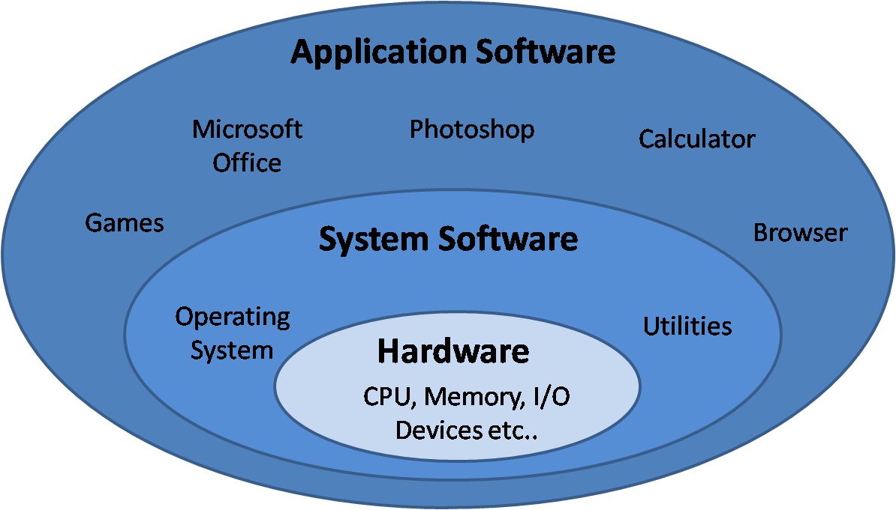

# Course Topics

- C Programming
- Memory Management
- Compilation
- Introduction to parallel programming

# Why C, C++, Python ?

Programming occurs at several abstraction levels from the hardware

{ width=60% }

---

# Why C, C++, Python ?

- Layers close to metal are harder to program...
    - But they offer maximum control and performance
- High-level abstraction maximize productivity...
    - But have significant overhead, less control over performance

In practice; we often combine multiple languages

  - C for performance critical sections, python for higher level APIs

---

# Why C, C++, Python ?

{ width=100% }

---

# C Programming - Operations and Typing

C is a strongly typed imperative language:

```c
int main() {
  int a = 5;
  int b = 10;

  int c = a + b;
  float d = c / a;
  float e = (float)c / a;

  int f = a * a * a * a;

  return 0;
}
```

`main` is the program entry point.

---

# C Programming - Functions

```c
#include <stdio.h> // For printf(...)

int sum_and_square(int a, int n) {
  int tmp = a + n;
  return tmp * tmp;
}

int main() {
  int a = 5;
  int b = 4;
  int c = sum_and_square(a, b);
  int d = sum_and_square(3, 9);

  // Print the result to the console
  printf("(5+4)**2: %d\n", c);
  printf("(3+9)**2: %d\n", d);
  return 0;
}
```

---

# C Programming - Loops

Implementation C de $\sum_{i=1}^{100}{i}$

```c
#include <stdio.h> // For printf(...)

int sum_range(const int start, const int end) {
  int sum = 0;
  // Consider start = 0; end = 100
  // For i starting at 0; while i <= 100; increment i by one
  for (int i = start; i <= end; i = i + 1) {
    sum += i;
  }
  return sum;
}

int main() {
  printf("Result: %d\n", sum_range(1, 100));
  return 0;
}
```
`const` qualified variable cannot be modified. This may enable optimizations during compilation.

--- 

# C Programming - Conditions

Numbers of multiple of 3 inside $[0, 99]$ (i.e. $i \mod 3 = 0$)
```c
unsigned int count = 0;
// For i starting at 0; while i < 100; increment i by one
for (unsigned int i = 0; i < 100; i++) {
  // if i % 3 (Remainder of the integer division) is equal to 0
  if (i % 3 == 0) {
    count++;
  }
}
printf("Result: %d\n", count);
```

---

# C Programming - Basic Pointers

```c
int a = 0;
int b = 5;

int* c = &a;
*c = *c + b;
printf("a: %d; b: %d; c: %d\n", a, b , *c);
```
`c` contains the address of `a`; so `*c = *c + b` write in `a` the sum of `a` and `b`.

| Adress      | Value       | Variable |
|--------------|--------------|----------|
| 0x004 | 0            | a        |
| 0x008 | 5            | b        |
| 0x00c | 0x04         | c        |
| ...          | ...          | ...      |

---

# C Programming - Arrays

```c
int main() {
  char morpion[9] = {'X', 'O',  '\0',
                     'O', 'X',  '\0',
                     'O', '\0', '\0'};
  morpion[8] = 'X'; // The player clicked on the bottom-right cell !
}
```

{ width=90% }

---

# C Programming - Structures

Structures are user-defined composite types:

```c
typedef struct {
  char* first_name;
  char* last_name;
  int age;
  float mean_grade;
  char gender;
} Student;
```

```c
Student e1 = {"Dupont", "Pierre", 22, 13, 'm'};
Student e2 = {"Major", "Major", 22, 13.5, 'a'};
Student e3 = {"Martin", "Evelynne", 24, 14, 'f'};

if (e1.mean_grade > 10) {
  printf("(%s %s) is a pretty good student !\n", 
         e1.first_name, e1.last_name);
}
```

C has no concept of `class`, `object`, or `method` !

---

# C programming - Structures 2

```c
void display_student(Student* s) {
  // s->age is equivalent to (*s).age
  printf("%s %s (%i): %f\n", s->first_name, 
                             s->last_name, s->age,
                             s->mean_grade);
}

// We can have arrays of any types !
Student students[3] = {{"Dupont", "Pierre", 22, 13, 'm'}, ...};
for (int i = 0; i < 3; i++)
  display_student(&students[i]);
```

{ width=75% }


---

# C Programming - Trading Abstraction for performance

## In C, we must manually take care of very low level concepts {.alert}

- We care about data layout, memory addresses, pointers, etc.
- The language doesn't provide linked lists, dynamic arrays, dictionaries, etc.
- No basic algorithms like sorting

## On the flip side, we can {.example}

- Manually lay out data to maximize efficiency
- Remove any abstractions and overhead to maximize performance
- Generate code  that runs as close to the metal as possible
- Optimize our program for the hardware

---

# C Programming - Trading Abstraction for performance (Example)

Consider the following python and C code:

```Python
sum = 0
for i in range(ub):
  sum += i
print(sum)
```

```c
unsigned long long sum = 0;
for (unsigned int i = 0; i < ub; i++){
    sum += i;
}
printf("Sum of first %llu integers is: %llu\n", ub, sum);
```

Where ub is a very large number (100 Millions in this example).
Which one is faster, and by how much ?

---

# C Programming - Trading Abstraction for performance (Example)

Results:

- `C` version: 0.024s
- `Python` version: 5.650s

That's a speedup of $\times 235$. 

We will see later in this course how this is possible thanks to the compiler.


## Numpy and other libraries  {.alert}

Note that we could use `numpy` or the `sum` python function: but those are actually implemented in `C`

---

# Managing Memory - Concept

## In High-level languages {.alert}

- We operate on abstracted data structures (lists, dictionaries, etc.)
- Memory is managed automatically (allocation, resizing, deallocation)
- We don't care about memory alignment, stack vs. heap, page size, Numa effects, etc.

## In C  {.example}

- We perform directly with primitive data and raw memory
- We are responsible for allocation, layout, and cleanup
- We can only request chunks of raw memory, and fill it however we choose
- This is critical for performance


This low level control is critical for performance; hence we must understand how memory works under the hood !

---

# Managing Memory - Memory Types

We can distinguish two types of memory

- Memory automatically allocated by the compiler on **the stack**.
    - Stores variables, functions arguments, etc.
    - Fast but limited in size
- Memory that is (manually) dynamically allocated on **the heap** 
    - Must be allocated and freed by the developer !

The kernel (Linux / Windows) allocates **memory pages** and operates at a coarse grain level.  
The standard library (`libc`) manipulates pages on a finer scale and provides memory to the user.

---

# Managing Memory - Allocation

```c
#include <time.h> // for time
#include <stdlib.h> // For malloc,  srand, rand

int do_the_thing(int n) {
  // We allocate n numbers
  float* numbers = malloc(sizeof(float) * n);

  // We seed the random number generator
  srand(time(NULL));

  // We generate nsamples random numbers
  for (int i = 0; i < n; i++) {
    numbers[i] = (float) rand() / RAND_MAX; // Generate a number in [0, 1]
  }
  ... // Do something complicated here
  free(numbers); // Release memory back to the kernel
  return 0;
}
```


---

# Managing Memory - Allocation

{ height=75% }

**`malloc` returns a pointer to the beginning of the allocated memory range**

---

# Managing Memory - Deallocation

Memory is not infinite ! 

In Python (and Java, C#, etc.); memory is managed by the garbage collector (GC):

- The runtime tracks all memory allocations; and all reference(s)
- When a memory block is not referenced by the program; the GC will release the memory back to the kernel.

In C/C++, **the user must deallocate memory** using `free(ptr)`. 

## Memory leak {.alert}

If memory is not freed (memory leak) the computer can run out:

- The kernel can kill the program
- The OS can crash
- Other applications requesting memory can crash or fail

---

# Virtual And Physical Memory - Problem

- How can the kernel guarantee that memory is always contiguous?
- Can I acess memory from another program and steal their data?
- How can multiple applications share the same memory?
  - Some variables have hard-coded addresses!
- How to handle (Internal/External) fragmentation (Empty slot slot)? 

---

# Virtual And Physical Memory - Concept

We separate **Physical Addresses** (locations in memory) from **Virtual Addresses** (Logic locations) seen by each program !

- Physical memory is divided into small **fixed-size blocks** called **pages** (typically ~4KB).
- The CPU includes a **Memory Management Unit** (MMU) that translates virtual addresses into physical addresses.
- Each program is given its own isolated virtual address space.
- The kernel maintains a **page table** for each program that tells the MMU how to translate addresses.

## The Illusion of contiguity
Each process believes it has acces to a large, contiguous block of memory; while it can be physically fragmented or shared.

---

# Virtual And Physical Memory - Diagram

{ width=80% }

\***Note that this is a simplified representation**.

---


# Memory Hierarchy

Which memory are we talking about ?

{ width=100% }

Note that GPU(s) also have their own separate memory !

---

# Memory Hierarchy

* CPU computations are extremely fast, and memory access can be a bottleneck
  - Registers have the lowest latency
  - CPU caches (L1, L2, L3) act as fast buffers for memory
* DRAM (main memory) is much slower, but cheaper and larger
  - Accessing DRAM causes significant delays compared to cache

To achieve high performance, we must maximize data reuse in registers or caches, and minimize DRAM access.

---

# CPU Caches

Most CPU have 3 levels of cache

- L1d - First Level Cache (Very fast)
- L2 - Second Level Cache (Fast)
- L3 (Last Level Cache - LLC) (Larger but slower than L1/L2)

Some cache level are per-core (L1, often L2) whereas others are shared between multiple cores (L3).

## Instruction Cache {.alert}

The assembly instructions are stored in a separate (L1i) instruction cache

---

# CPU Caches

{ width=95% }

We speak of **Heterogeneous Memory Hierarchy**: the same memory accesses can have different latency depending on where the data resides !


[**Live example: LSTOPO**]

---

# CPU Caches - In practice

```c
for (int i = 0; i < n; i++) {
  T[i] = A[i] * B[i];
}
```

1. The cache controller looks-up the data inside the CPU cache (L1 -> L2 -> L3)
2. If available, data is sent to register for the ALU
3. Else, a memory request is emitted
  - This introduces latency and a bubble in the CPU pipeline
4. When the memory request is resolved; execution resumes
5. The results of $a*b$ is written to cache, and eventually back to main memory later on.

---

# CPU Caches - In practice

In practice:

- The CPU fetches entire **cache line** (Often 64 Bytes) at once (If float: $64B / 4B = 16$ values at once) 
- The CPU can **prefetch** data: it learns data access patterns and anticipates future memory access.
- The CPU can execute **out-of-order**; independent instructions are executed while the memory request is in flight.

---

# Caches CPU - Strided Access

Consider two NBody 3D implementations:

**Array Of Structure (AoS)**

```c
// We allocate N tuples of (x, y, z) positions
float* positions = malloc(sizeof(float) * N * 3);
```

**Structure Of Array (SoA)**

```c
// We allocate separate arrays for each components
float* x = malloc(sizeof(float) * N);
float* y = malloc(sizeof(float) * N);
float* z = malloc(sizeof(float) * N);
```

---

# Caches CPU - Strided Access

We want to record the number of particles with $x \leq 0.5$


**Array Of Structure (AoS)**

```c
for (int i = 0; i < N; i += 3)
  if (positions[i] < 0.5)
    count++;
```

**Structure Of Array (SoA)**

```c
for (int i = 0; i < N; i++)
  if (x[i] < 0.5)
    count++;
```

Which one is faster; and why ?

Which access pattern makes better use of cache lines ?

---

# Caches CPU - Strided Access

`Perf` results summed across 100 runs:

|  | Time   | # Instr | # L1 Loads   | # L1 Miss  | # LLC Loads | # LLC Miss |
|--------|--------|---------------|--------------|------------|-------------|------------|
| AoS    | ~1.93s  | ~14 Billion   | ~3.5 Billion | ~1 Million | ~400k       | ~382k      |
| SoA    | ~1.75s | ~14 Billion   | ~3.5 Billion | ~300k      | ~24k        | ~15k       |

|  | # Cache references (LLC) | # Cache miss |
|--------|------------------------|--------------|
| AoS    | ~158 Million           | ~151 Million |
| SoA    | ~52 Million            | ~35 Million  |

With AoS more load fail in the L1, leading to LLC accesses.

Most LLC loads still results in misses, leading to DRAM access.

---

# Compilation & Assembly

C is a compiled language: we must translate the source code to assembly for the CPU

`gcc ./main.c -o main (<flags>)`

- Python is interpreted
  - More flexible but **significantly slower**
- C# and Java are compiled to intermediary bytecode and then executed via a virtual machine (or JIT-ed)
  - Balances performance and productivity
- C/C++/Rust are compiled to assembly code
  - Poor portability, but no intermediary.

---

# Compilation & Assembly - Simple Loop

```c
int sum = 0;
for (int i = 0; i < 100000; i++){
  sum += i;
}
```

```asm
main:
.LFB6:
	pushq	%rbp                 // We record the stack pointer
	movq	%rsp, %rbp
	movl	$0, -4(%rbp)         // Initialize sum
	movl	$0, -8(%rbp)         // Initialize i
	jmp	.L2
.L3:
	movl	-8(%rbp), %eax       // Load sum to a register
	addl	%eax, -4(%rbp)       // Add i and sum (from memory)
	addl	$1, -8(%rbp)         // Add 1 to i (from memory)
.L2:
	cmpl	$99999, -8(%rbp)     // Check if i < 100 000
	jle	.L3                      // Jump Less Equal
	movl	$0, %eax             // Set the return value of main
	popq	%rbp
	ret                          // Return from main
```

`gcc ./main.c -o main -OO`

---

# Compilation & Assembly

Assembly is as close to the metal we usually get, and is architecture dependant:

- Intel and AMD use the x86 Instruction Set 
- x86 has multiple extensions (FMA, sse, avx, avx512, etc.)
- To maximize performance, we should compile our applications on each platform
  - Our binaries are not portable
  - But we can use dedicated instructions
- Other instructions set exists (ARM, Risc V, etc.)

---

# Compilation & Assembly - Optimization passes

The compiler is not *just* a translator:

- The compiler can generate optimized instructions from our program
- Constant values can be propagated, unused values/code removed
- Operations can be reordered, inlined, vectorized using SIMD, etc.
- Many, many more optimizations

Those optimizations are enable through flags such as `-O1`, `-O2`, -`O3` which are predefined sets of optimization passes.

The flag `-march=native` allows the compiler to target the current machine for compilation and use all the available ASM extensions.

---

# Compilation & Assembly - Compiler Pipeline

{ width=105% }

There are several compilers with varying performance and features:

- GCC and Clang-LLVM (The classics)
- MSVC (Microsoft), mingw-LLVM, arm-clang (For ARM) and many, many others.

---

# Introduction to parallelism

Compiler optimization is only one side of high peformance computing.

If you remember; we saw in `LSTOPO` that our CPU has many cores:

- Every core can perform computations independently of the other
- Multiple process (Google, vscode, firefox, excel) can run **simultaneously** on different cores.
- The kernel manages execution through thread scheduling and time-slicing

## Main Thread {.example}
Every process has at least one "thread of execution", which is an ordered sequence of instructions executed by the CPU.

---

# Introduction to parallelism

What if we could split our programs into multiple threads ?

- If we have 1 thread only one computation happens at a time
- If we have 2 threads, we can potentially double throughput !

In practice, there is some overhead, we must handle dependencies between instructions, etc.

---

# Introduction to parallelism - Types of parallelism

We consider three main types of parallelism

- Single Instruction Multiple Data (SIMD): also called Vectorization
  - single instruction operates simultaneously on multiple data elements.
- Shared Memory: Multiple threads inside the same memory space
  - Threads share a memory space, enabling fast communication and synchronization.
- Distributed Memory: Multiple processes
  - Communications are slower, but this model enables scaling across multiple machines.

For this course, we will only focus on SIMD and Shared Memory parallelism.

---

# Introduction to parallelism - Shared Memory

Consider the following loop:

```c
int sum = 0;
for (int i = 0; i < 100; i++)
  sum += i;
```

We can slice the iteration space in multiple chunks:

{ width=100% }

---

# Introduction to parallelism - Shared Memory

We split the program into multiple instruction sequences running in parallel.

- Every thread operates a sum on a subset of the data
- We synchronize every thread and combine the partial sums via a global reduction.

`OpenMP` is an HPC tool designed for scenarios like this !

It's a simple to use library/compiler pass to parallelize trivial loops.

---

# Introduction to parallelism - `OpenMP`

```c
int sum = 0;

#pragma omp parallel for reduction(sum: +)
for (int i = 0; i < 100; i++)
  sum += i;
```
`gcc ./main.c -fopenmp -O3 -march=native`

This directive automatically distributes the loop iterations across all available CPU cores, 
performing a thread-safe reduction on sum.

---

# Introduction to parallelism - `OpenMP` details

`OpenMP` defines a set of `clause` which are operations followed by a set of modifiers.

- `#pragma omp`: is the start of all OpenMP clauses
- `parallel:` enable the creations of multiple threads
- `for`: toggle the automatic slicing of following loop
- `reduction(sum: +)`: toggles a reductions clause for sum using the `+` operation.

This code will be enough for most cases; but `OpenMP` allows for significantly more complex operations.

---

# Introduction to parallelism - Advanced `OpenMP` Example

```c
float global_min = FLT_MAX;
int global_min_index = -1;
#pragma omp parallel
{
  float min_value = FLT_MAX;
  int min_index = -1;
#pragma omp for nowait schedule(dynamic)
  for (int i = 0; i < N; i++) {
    if (T[i] < min_value) {
      min_value = T[i];
      min_index = i;
    }
  }
#pragma omp critical
  {
    if (min_value < global_min) {
      global_min = min_value;
      global_min_index = min_index;
    }
  }
}
```

---

# Naive NBody 3D Strong Scaling - Setup

We increase the number of threads while keeping the work size constant.

`OMP_PLACES={0,2,4,6,8,10,12,14} OMP_PROC_BIND=True OMP_NUM_THREADS=8 ./nbody 10000`
`sudo cpupower frequency-set -g performance`

5 Meta repetitions per run, 13th Gen Intel(R) Core(TM) i7-13850HX @5.30 GHz, 32KB/2MB/30MB:L1/L2/L3 15GB DDR5.

# Naive NBody 3D Strong Scaling - Results

{ width=80% }

Speedup is limited by runtime overhead, concurrency, memory bandwidth, data size, etc.
