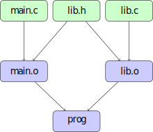
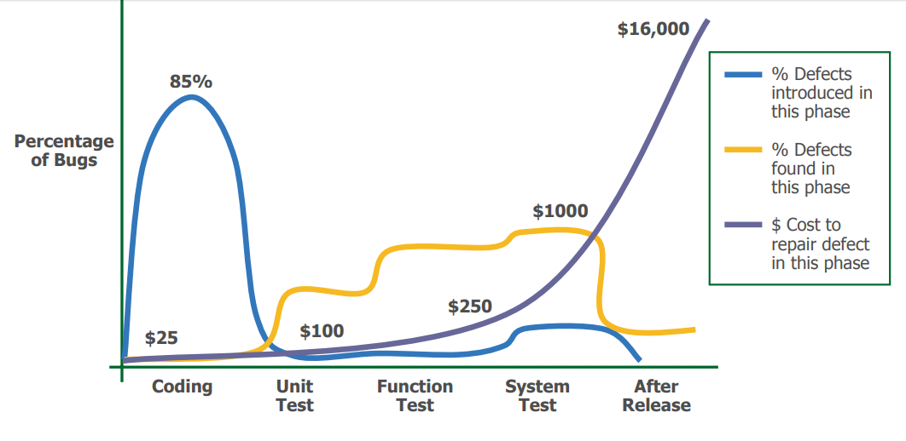

# Building, Testing and Debugging Scientific Software

<div class="mkdocs-only" markdown>
  <p align="right" markdown>
  [Download as slides 📥](slides/lecture3.pdf)
  </p>
</div>

## Objectives

- Build systems: Advanced Makefiles, introduction to CMake for managing multi-file and multi-platform projects.
- Debugging: GDB, Valgrind for detecting memory errors and leaks.
- Software testing:
    - Principles: Unit testing, integration testing.
    - Test frameworks in C (e.g., Unity).
    - Importance of testing for regression prevention and validation.
- Code documentation: Doxygen.

# Makefiles

## Dependency Management

- How to determine which files have changed?



- **dependencies**: `main.o` depends on changes in `lib.h`

## Makefile

- A `Makefile` uses a declarative language to describe targets and their dependencies.

- It is executed by the `make` command, which allows building different **targets**.

    - `make` uses timestamps to determine which files have changed.

    - `make` evaluates rules recursively to satisfy dependencies.

## Makefile Rule

```Makefile
prog: main.c lib.c lib.h
  clang -o prog main.c lib.c -lm

target: dependencies
\t  command to build the target from the dependencies
```

## Separate Compilation

```Makefile
prog: main.o lib.o
  clang -o prog main.o lib.o -lm

main.o: main.c lib.h
  clang -c -o main.o main.c

lib.o: lib.c lib.h
  clang -c -o lib.o lib.c
```

If `lib.c` is modified, which commands will be executed?

## Phony Targets

You can add targets that do not correspond to a produced file. For example, it is useful to add a `clean` target to clean the project.

```Makefile
clean:
  rm -f *.o prog
.PHONY: clean
```

`.PHONY` specifies that the `clean` rule should always be executed. Declaring all phony targets ensures they are always called (even if a file with the same name is created).

## Default Rule

```bash
make clean
make prog
make
```

- If `make` is called with a rule, that rule is built.
- If `make` is called without arguments, the first rule is built. It is customary to include a default `all:` rule as the first rule.

```Makefile
all: prog

prog: ...
```

## Variables

```Makefile
CC=clang
CFLAGS=-O2
LDFLAGS=-lm

prog: main.o lib.o
  $(CC) -o prog main.o lib.o $(LDFLAGS)

main.o: main.c lib.h
  $(CC) $(CFLAGS) -c -o main.o main.c

lib.o: lib.c lib.h
  $(CC) $(CFLAGS) -c -o lib.o lib.c
```

Variables can be overridden when calling `make`, e.g.,

```bash
make CC=gcc
```

## Special Variables

----  ------------------------
`$@`  target name
`$^`  all dependencies
`$<`  first dependency
----  ------------------------

```Makefile
prog: main.o lib.o
  $(CC)  -o $@ $^ $(LDFLAGS)

main.o: main.c lib.h
  $(CC) $(CFLAGS) -c -o $@ $<

lib.o: lib.c lib.h
  $(CC) $(CFLAGS) -c -o $@ $< 
```

The last two rules are very similar...

## Implicit Rules

### Before

```Makefile
main.o: main.c lib.h
  $(CC) $(CFLAGS) -c -o $@ $<

lib.o: lib.c lib.h
  $(CC) $(CFLAGS) -c -o $@ $< 
```

### With Implicit Rule

```Makefile
%.o: %.c
  $(CC) $(CFLAGS) -c -o $@ $<

main.o: lib.h
lib.o: lib.h
```

## Other Build Systems

- **automake / autoconf**: automatic generation of complex makefiles and management of system-specific configurations.

- **cmake, scons**: successors to Makefile, offering more elegant syntax and new features.

# CMake

## Why CMake?

- **Advantages of Makefiles:**
    - Simplicity and transparency.
    - No additional tools required.
    - Direct control over the build process.

- **Advantages of CMake:**
    - Cross-platform support (Linux, Windows, macOS).
    - Generates build files for multiple build systems (Make, Ninja, etc.).
    - Modular and target-based design.
    - Built-in support for testing, installation, and packaging.

## General Design of CMake

- **CMake as a Meta-Build System:**
    - Generates build files for different generators (e.g., Make, Ninja).
    - Abstracts platform-specific details.

- **Workflow:**
    1. Write `CMakeLists.txt` to define the project.
    2. Configure the project:

       ```sh
       cmake -B build
       ```

    3. Build the project:

       ```sh
       cmake --build build
       # or when using Make as backend
       make -C build
       ```

  **Out-of-source builds** are recommended to keep source directories clean.

## Basic Structure of `CMakeLists.txt`

```cmake
cmake_minimum_required(VERSION 3.15)
project(MyProject LANGUAGES C)

set(CMAKE_C_STANDARD 11)
```

- **`cmake_minimum_required`:** Specifies the minimum version of CMake required.
- **`project`:** Defines the project name and the programming language(s) used.
- **`set`:** Sets variables, e.g., C standard version.

## Adding an Executable

```cmake
add_executable(my_executable src/main.c)
```

- Creates an executable named `my_executable`.

## Adding a Shared Library

```cmake
add_library(my_library SHARED src/library.c)
```

- Creates a shared library named `libmy_library.so` (on Linux).

## Linking Libraries to Executables

```cmake
add_library(my_library SHARED src/library.c)
add_executable(my_executable src/main.c)
target_link_libraries(my_executable PRIVATE my_library)
```

- **`add_library`:** Creates a shared library.
- **`add_executable`:** Creates an executable.
- **`target_link_libraries`:** Links the library to the executable.

PRIVATE means that `my_executable` uses `my_library`, but `my_library` does not need to be linked when other targets link to `my_executable`.

## Library dependency transitivity

```cmake
add_library(libA SHARED src/libA.c)
add_library(libB SHARED src/libB.c)
target_link_libraries(libB PUBLIC libA)
add_executable(my_executable src/main.c)
target_link_libraries(my_executable PRIVATE libB)
```

- `my_executable` is linked to `libB` and also to `libA` because `libB` links to `libA` with `PUBLIC`.
- If `libB` linked to `libA` with `PRIVATE`, `my_executable` would not be linked to `libA`.
- If `libB` linked to `libA` with `INTERFACE`, `my_executable` would be linked to `libA` but not `libB`.
- See [this reference](https://cmake.org/cmake/help/latest/command/target_link_libraries.html) for more details.

## Global Include Directories

```cmake
include_directories(include)
```

- Adds the `include` directory globally for all targets.
- **Limitation:** Can lead to conflicts in larger projects.

## Target-Specific Include Directories

```cmake
target_include_directories(my_library
    PUBLIC include
)
```

- **PUBLIC:** Include directory is needed when building and using the library.
- **PRIVATE:** Include directory is needed only when building the library.
- **INTERFACE:** Include directory is needed only when using the library.

## Porting our minimal Makefile example to CMake

```cmake
cmake_minimum_required(VERSION 3.15)
project(MyProject LANGUAGES C)

# Add the executable target
add_executable(prog main.c lib.c)

# Specify include directories for the target
target_include_directories(prog 
  PRIVATE ${CMAKE_CURRENT_SOURCE_DIR})

# Add compile options
target_compile_options(prog PRIVATE ${CFLAGS})

# Link libraries if needed
target_link_libraries(prog PRIVATE m)
```

## Debug vs Release Builds

- **Debug Build:**
    - Includes debug symbols for debugging.
    - Example flags: `-g`, `-O0`.

- **Release Build:**
    - Optimized for performance.
    - Example flags: `-O3`, `-DNDEBUG`.

## Setting Build Types in CMake

```cmake
if(NOT CMAKE_BUILD_TYPE)
  set(CMAKE_BUILD_TYPE RelWithDebInfo CACHE STRING "Build type" FORCE)
endif()
```

- Build types: `Debug`, `Release`, `RelWithDebInfo`, `MinSizeRel`.

    - CACHE: Makes the variable persistent across CMake runs. In out-of-source builds `CMakeLists.txt` is not re-evaluated on subsequent runs.
    - FORCE: Overrides any previous value.
    - STRING: "Build type" provides a description in CMake GUI.

## Adding Compiler Flags

```cmake
target_compile_options(my_library PRIVATE
    $<$<CONFIG:Debug>:-g -Wall>
    $<$<CONFIG:Release>:-O3 -DNDEBUG>
)
```

- **Generator Expressions:** `$<CONFIG:Debug>` applies flags only for Debug builds.

## Installing Targets

```cmake
install(TARGETS my_library
    LIBRARY DESTINATION lib
    PUBLIC_HEADER DESTINATION include
)
```

- Installs the shared library to the `lib` directory.
- Installs public headers to the `include` directory.

## Using GNUInstallDirs

```cmake
include(GNUInstallDirs)

install(TARGETS my_library
    LIBRARY DESTINATION ${CMAKE_INSTALL_LIBDIR}
    PUBLIC_HEADER DESTINATION ${CMAKE_INSTALL_INCLUDEDIR}
)
```

- Defines standard GNU library and include directories paths.

## Generating and Building the Project

1. **Configure the Project:**

   ```sh
   cmake -B build
   ```

   - Generates build files in the `build` directory.

2. **Build the Project:**

   ```sh
   cmake --build build
   # or when using Make as backend
   make -C build
   ```

3. **Run the Program:**

   ```sh
   ./build/my_executable
   ```

## Best Practices for CMake

- **Use Target-Based Commands:**
    - Prefer `target_include_directories` over `include_directories`.
    - Prefer `target_link_libraries` over global linking.

- **Organize `CMakeLists.txt`:**
    - Group related targets together.
    - Use comments to explain sections.

- **Use Modern CMake Features:**
    - Generator expressions for conditional configurations.
    - `FetchContent` for managing external dependencies.

# Debugging Tools

## Buggy program example

```c
/* Linked list of n = 5 nodes
         .---------.    .---------.           .--------------.
         | val = 4 |    | val = 3 |           | val = 0      |
 head -> | next  --|--> | next  --|--> ... -> | next =  NULL |
         '---------'    '---------'           '--------------'
 */

#include <stdlib.h>
#include <assert.h>

struct Node
{
  int val;
  struct Node *next;
};

int main()
{
  int n = 5;

  struct Node *head = init_list(n);
  // ... do something with the list ...
  delete(head);

  return 0;
}
```

## Linked List Initialization and Deletion

```c
struct Node *init_list(int n)
{
  struct Node *head = NULL;
  for (int i = 0; i < n; ++i)
  {
    struct Node *p = malloc(sizeof *p);
    assert(p != NULL);
    p->val = i;
    p->next = head;
    head = p;
  }
  return head;
}

void delete(struct Node *head)
{
  while (head)
  {
    struct Node *next = head->next;
    free(head);
    head = head->next;
  }
}
```

## Running the program...

```bash
$ gcc -g -O0 -o buggy buggy.c
$ ./buggy
Segmentation fault (core dumped)
```

## GDB: GNU Debugger

- Inspect the state of a program at the moment it crashes.
- Step through the code line by line.
- Inspect variables and memory.
- Set breakpoints to pause execution at specific lines.

(Live demonstration)

```bash
$ gdb ./buggy
Program received signal SIGSEGV, Segmentation fault.
0x000055555555522b in delete (head=0xa45d97b66d0683e8) at buggy.c:28
28          struct Node *next = head->next;
(gdb) x head
0xa45d97b66d0683e8:     Cannot access memory at address 0xa45d97b66d0683e8
```

## Valgrind: memory debugging and leak detection

- Detects memory leaks, invalid memory access, and uninitialized memory usage.
- Runs the code in a virtual sandbox that monitors every memory operation.

(Live demonstration)

```bash
$ valgrind --leak-check=full ./buggy
==537945== Invalid read of size 8
==537945==    at 0x109243: delete (buggy.c:30)
==537945==    by 0x109282: main (buggy.c:40)
==537945==  Address 0x4a94188 is 8 bytes inside a block of size 16 free'd
==537945==    at 0x484988F: free (in /usr/libexec/valgrind/vgpreload_memcheck-amd64-linux.so)
==537945==    by 0x10923E: delete (buggy.c:29)
==537945==    by 0x109282: main (buggy.c:40)
==537945==  Block was alloc'd at
==537945==    at 0x4846828: malloc (in /usr/libexec/valgrind/vgpreload_memcheck-amd64-linux.so)
==537945==    by 0x1091B2: init_list (buggy.c:15)
==537945==    by 0x109272: main (buggy.c:38)
```

## Other tools: ASAN, UBSAN

- **AddressSanitizer (ASAN):** Detects memory errors such as buffer overflows and use-after-free.
- **UndefinedBehaviorSanitizer (UBSAN):** Detects undefined behavior in C/C++ programs.
- Works on threaded programs and has lower overhead than Valgrind.

(live demonstration)
```bash
$ gcc -fsanitize=address -g -O0 -o buggy_asan buggy.c
$ ./buggy_asan
=================================================================
==538335==ERROR: AddressSanitizer: heap-use-after-free on address 0x502000000098 at pc 0x5bec7c7343e9 bp 0x7ffdf3015150 sp 0x7ffdf3015140
READ of size 8 at 0x502000000098 thread T0
    #0 0x5bec7c7343e8 in delete /home/poliveira/test-gdb/buggy.c:30
    #1 0x5bec7c73442c in main /home/poliveira/test-gdb/buggy.c:40
```

# Software Testing

## Importance of Software Testing

- 1996: Ariane-5 self-destructed due to an unhandled floating-point exception, resulting in a \$500M loss.
- 1998: Mars Climate Orbiter lost due to navigation data expressed in imperial units, resulting in a \$327.6M loss.
- 1988-1994: FAA Advanced Automation System project abandoned due to management issues and overly ambitious specifications, resulting in a \$2.6B loss.
- 1985-1987: Therac-25 medical accelerator malfunctioned due to a thread concurrency issue, causing five deaths and numerous injuries.

## Technical Debt



## Software Costs


## Verification and Validation (V&V)

- **Validation**: Does the software meet the client's needs?  
    - "Are we building the right product?"

- **Verification**: Does the software work correctly?  
    - "Are we building the product right?"

## Approaches to Verification

- Formal methods
- Modeling and simulations
- Code reviews
- **Testing**

## Testing Process


## V Cycle Model


## Different Types of Tests

- **Unit Tests:**
    - Test individual functions in isolation.
    - Test-driven development (TDD): Focus on writing maintainable, simple, and decoupled code.

- **Integration Tests:**
    - Test the correct behavior when combining modules.
    - Validate only functional correctness.

- **Validation Tests:**
    - Test compliance with specifications.
    - Test other characteristics: performance, security, etc.

- **Acceptance Tests:**
    - Validate requirements with the client.

- **Regression Tests:**
    - Ensure that fixed bugs do not reappear.

## Black-Box and White-Box Testing

### Black-Box Testing (Functional)

- Tests are generated from specifications.
- Uses assumptions different from the programmer's.
- Tests are independent of implementation.
- Difficult to find programming defects.

### White-Box Testing (Structural)

- Tests are generated from source code.
- Maximizes coverage by testing all code branches.
- Difficult to find omission or specification errors.

Both approaches are complementary.

## What to Test?

- Running the program on all possible inputs is too costly.
- Choose a subset of inputs:
    - Partition inputs into equivalence classes to maximize coverage.
    - Test all code branches.
    - Test edge cases.
    - Test invalid cases.
    - Test combinations (experimental design).

## Example of Partitioning (1/3)

### Specification

```c
/* compare returns:
 *   0 if a is equal to b
 *   1 if a is strictly greater than b
 *  -1 if a is strictly less than b
 */
int compare (int a, int b);
```

What inputs should be tested?

## Equivalence Classes (2/3)

| Variable | Possible Values            |
|----------|----------------------------|
| a        | {positive, negative, zero} |
| b        | {positive, negative, zero} |
| result   |                 {0, 1, -1} |

### Example Test Cases

| a   | b   | result |
|-----|-----|--------|
| 10  | 10  | 0      |
| 20  | 5   | 1      |
| 3   | 7   | -1     |
| -30 | -30 | 0      |
| -5  | -10 | 1      |
| ... | ... | ...    |

It is possible to select a subset of classes!

## Boundary Tests (3/3)

|a          | b  | result
|-----------|----|-------
|-2147483648|-1  | -1

## Discussion

- Automatic test generation.
- Test coverage calculation.
- Mutation testing.
- Fuzzing.
- Importance of using automated testing tools.
- Importance of using continuous integration tools.


# Unity Test Framework

## Introduction to Unity

  

  [Unity Test Framework](http://www.throwtheswitch.org/unity)

  - Lightweight and simple unit testing framework for C.
  - Designed for embedded systems but can be used in any C project.
  - Provides a set of macros and functions to define and run tests.
  

## Setting Up Unity 

- Separate Unity tests into a separate directory, e.g., `tests/`. 

- Include the Unity header in your test files:

  ```c
  #include "unity.h"
  ```

- Requires linking against the Unity library
- We will link against a static library `libunity.a`, since Unity uses CMake, we will use FetchContent to add it to our projects.

## Writing Tests

- test_functions use `TEST` macros provided by Unity to assert conditions.

  ```c
  void test_function_name(void) {
      ...
      TEST_ASSERT_EQUAL_INT(expected, actual);
      TEST_ASSERT_NOT_NULL(pointer);
      TEST_ASSERT_TRUE(condition);
      ... 
  }
  ```

- Reference for all assertions: [Unity Assertions](https://github.com/ThrowTheSwitch/Unity/blob/master/docs/UnityAssertionsReference.md)

## Example: testing our linked list

```c
#include "unity.h"
#include "buggy.h"
void test_delete_single_node(void) {
    struct Node *head = init_list(1); 
    TEST_ASSERT_NOT_NULL(head); // head should not be NULL
    TEST_ASSERT_EQUAL_INT(0, head->val); // head should be 0
    delete(head); // should not crash
    TEST_ASSERT_NULL(head); // head should be NULL after deletion
}
void test_delete_multiple_nodes(void) {
    struct Node *head = init_list(5);
    TEST_ASSERT_EQUAL_INT(4, head->val); // head should be 4
    TEST_ASSERT_EQUAL_INT(3, head->next->val); 
    delete(head); // should not crash
    TEST_ASSERT_NULL(head); // head should be NULL after deletion
}
```

## Running Tests

- Create a test runner function to execute all tests:

  ```c
  int main(void) ## Boundary Tests{
      UNITY_BEGIN();
      RUN_TEST(test_function_name);
      ...
      return UNITY_END();
  }
  ```

## SetUp and TearDown

- SetUp and TearDown functions can be defined to run before and after each test.

  ```c
  void setUp(void) {
      // Code to run before each test
  }

  void tearDown(void) {
      // Code to run after each test
  }
  ```

## Code Coverage with unit tests

- Use `gcov` or `llvm-cov` to measure code coverage of your tests.
- Compile your code with coverage flags:

  ```sh
  gcc --coverage -g -O0 -o test_runner test_runner.c my_code.c -lunity
  ```

- gcov instruments the basic blocks of code to record what is executed during tests.

- gcovr generate HTML reports showing which parts of the code were covered by tests.

## Documentation with Doxygen
- Doxygen is a documentation generator for C, C++, and other languages.
- It extracts comments from the source code and generates documentation in various formats (HTML, LaTex, etc.).
- Use special comment blocks to document functions, parameters, return values, and more.
- Example of a documented function:

```c
/**
 * @brief Initializes a linked list with n nodes.
 * @param n Number of nodes to create.
 * @return Pointer to the head of the linked list
 * @return NULL if memory allocation fails.
 */
struct Node *init_list(int n);
```

- Generate documentation using the `doxygen` command with a configuration file (`Doxyfile`).

## Credits and Bibliography

- Course "Automated Software Testing," Sébastien Bardin.
- [CMake Tutorial](https://cmake.org/cmake/help/latest/guide/tutorial/index.html)
- [CMake Best Practices](https://cliutils.gitlab.io/modern-cmake/)
- [Unity Test Framework](http://www.throwtheswitch.org/unity)
- [Valgrind](http://valgrind.org/)
- [GDB](https://www.gnu.org/software/gdb/)
- [ASAN/UBSAN](https://clang.llvm.org/docs/AddressSanitizer.html)
- [Doxygen](https://www.doxygen.nl/index.html)
