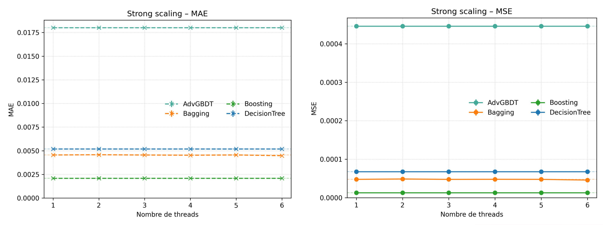
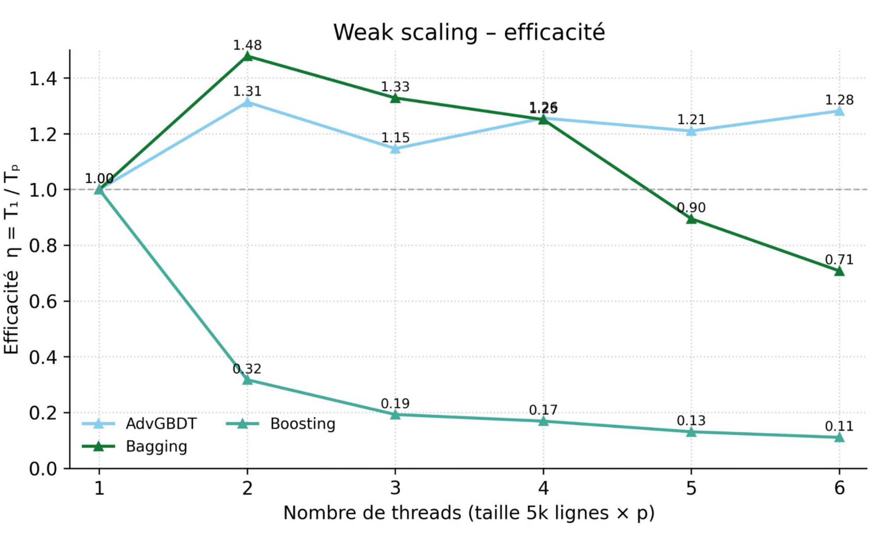
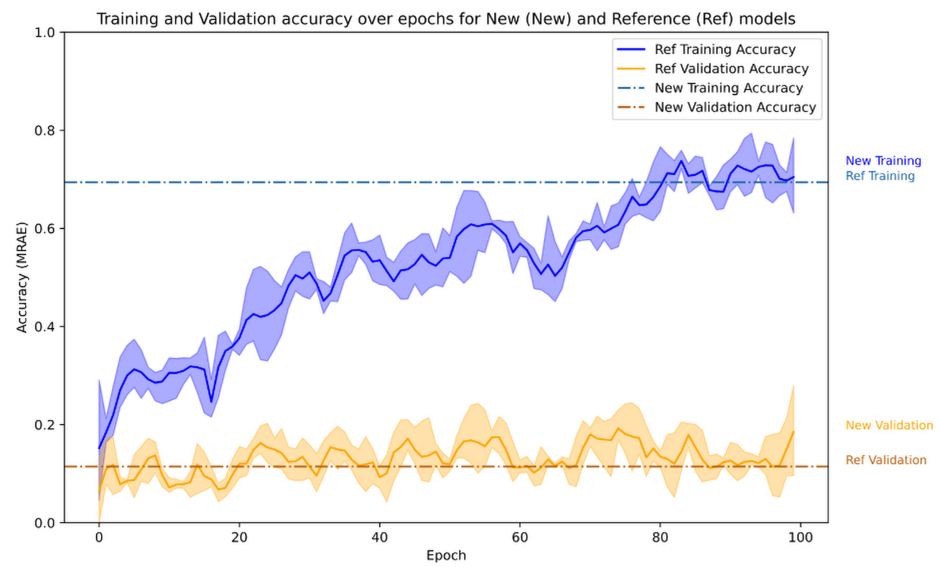
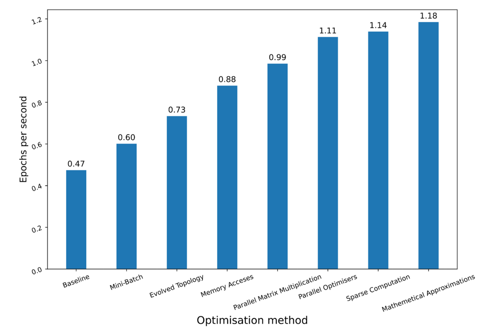
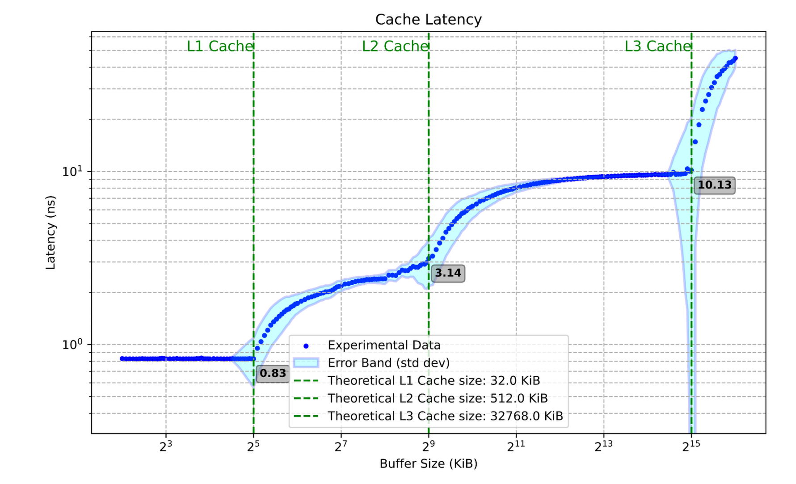
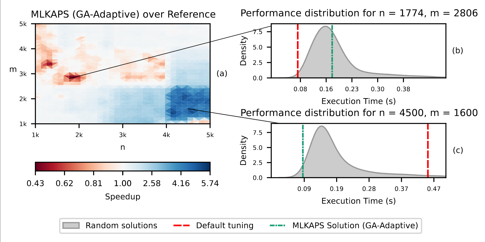
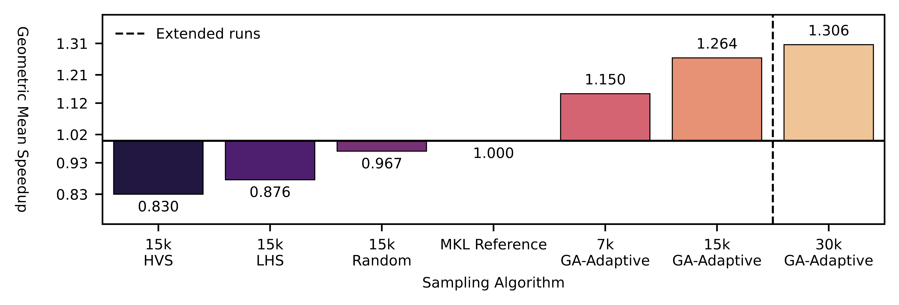
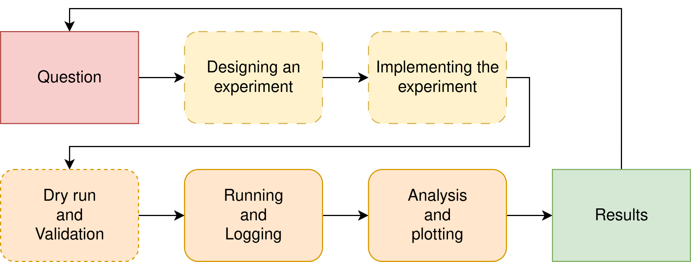
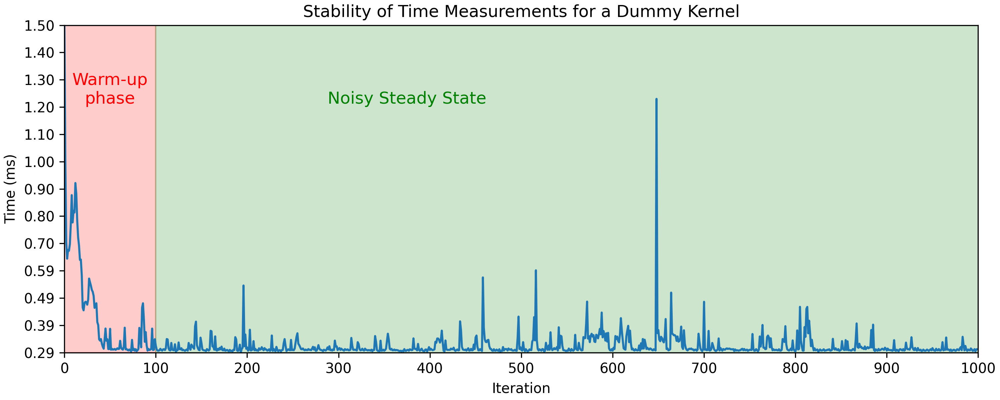
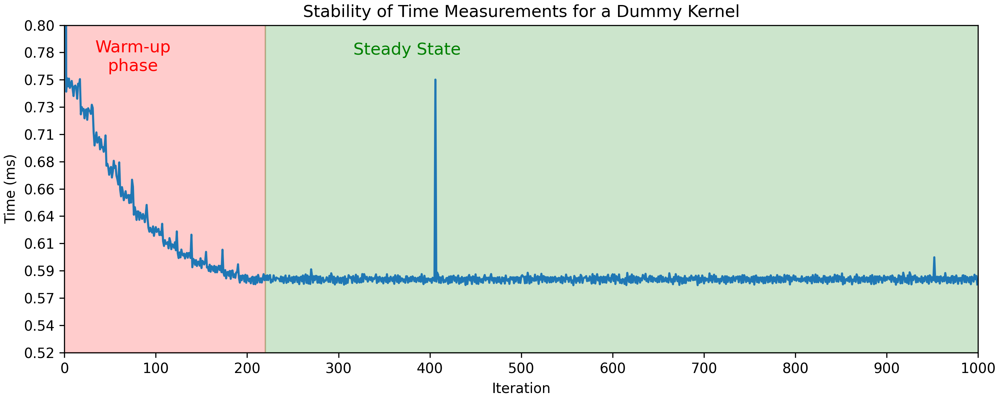

  

  [Download as slides 📥](slides/lecture4.pdf)
  

# Scientific visualization

## Plot Example - Intro

In the following slides, you will be shown a series of plots; mainly taken from the PPN course reports of previous students.

For each plot:

- Try to understand what is represented
- Explain what you observe
- Give a **definitive** conclusion from the data shown

Raise your hands when ready to propose an explanation.

## Plot Example (1)

{ width=100% }

**PPN Example** - (No Caption)

## Plot Example (2)

{ width=80% }

**PPN Example** - (No Caption)

## Plot Example (3)

{ width=100% }

**PPN Example** - (No Caption)

## Plot Example (4)

{ width=100% }

**PPN Example** - "Récapitulatif des optimisations faites"

## Plot Example (5)

{ width=100% }

**PPN Example** - "Nouveau tracé de la latence cache"

## Plot Example (6)

{ width=100% }

**Prof Example** - (KNM): (a) Speedup map of GA-Adaptive (7k samples) over the Intel MKL hand-tuning for `dgetrf` (LU), higher is better. (b) Analysis of the slowdown region (performance regression). (c) Analysis of the high speedup region. $3,000$ random solutions were evaluated for each distribution.

## Plot Example (7)

{ width=100% }

**Prof Example** - (SPR): Geometric mean Speedup (higher is better)  against the MKL reference configuration on `dgetrf` (LU), depending on the sampling algorithm. 46x46 validation grid. 7k/15k/30k denotes the samples count. GA-Adaptive outperforms all other sampling strategies for auto-tuning. With 30k samples it achieves a mean speedup of $\times 1.3$ of the MKL dgetrf kernel.

## Plot Example - What makes a good plot

Ask yourself:

- What do I want to communicate ?
- What data do I need ?
- **Is my plot understandable in ~10 seconds ?**
- Is my plot self-contained ?
- Is the context, environment, and methodology clear ?

## Plot Example - Summary

HPC is a scientific endeavour; data analysis and plotting are essential.

- Plots drive decisions
- Plots make results trustworthy
- Plots explain complex behaviors

Datasets are large, multi-disciplinary, and often hard to reproduce.

# Experimental Methodology

## Experimental Methodology - Workflow

{ width=100% }

## Statistical significance - Introduction

Computers are noisy, complex systems:

- Thread scheduling is non deterministic -> runtime varies between runs.
- Dynamic CPU frequency (Turbo/Boost)
- Systems are heterogeneous (CPU/GPU, dual socket, numa effects, E/P cores)
- Temperature/thermal throttling can alter runtime

How can we make sure our experimental measurements are reliable and conclusive?

## Statistical significance - Warm-up effects

Systems need time to reach steady-state:

{ width=100% }

**On a laptop**: $\mathrm{Mean} = 0.315\ \mathrm{ms},\ \mathrm{CV} = 13.55\%$  

We need "warm-up" iterations to measure stable performance and skip cold caches, page faults, frequency scaling.

## Statistical significance - Noise mitigation

Noise can only be mitigated:

- Stop all other background processes (other users)
- Stabilize CPU Frequency (`sudo cpupower -g performance`)
    - Make sure laptops are plugged to avoid powersaving policies
- Pin threads via `taskset`, `OMP_PLACES` and `OMP_PROC_BIND`
- Consider hyperthreading
- Use stable compute nodes

Meta-repetitions are essential to mitigate noisy measurements.

## Statistical significance - Example

Same experiment on a stabilized benchmarking server:

{ width=100% }

**On a laptop:** $\mathrm{Mean} = 0.315\ \mathrm{ms},\ \mathrm{CV} = 13.55\%$  
**Stabilized node:** $\mathrm{Mean} = 0.582\ \mathrm{ms},\ \mathrm{CV} = 1.14\%$

### Note {.example}
  Timing on a laptop is always subpar

## Statistical significance - Mean, Median, Variance

Single-run measurements are misleading; we need statistics.

- Mean runtime $\bar{x} = \frac{1}{n}\sum_{i=1}^{n}x_i$
- Median: less sensitive to outliers than the mean
- Variance/standard deviation: Measure of uncertainty
- Relative metrics are useful: Coefficient of variation ($CV = \frac{\sigma}{\bar{x}} \times 100 \%$)

We usually give both the mean and standard deviation when giving performance results.
Plots usually show $\bar{x} \pm 1 \sigma$ as a shaded region around the mean to represent uncertainty.

### Note {.example}
  Distribution plots can be useful: stable measurements are often close to Gaussian, 
  even if systematic noise may lead to skewed or heavy-tailed distributions.

## Statistical significance - Confidence Intervals

How to decide how many repetitions we should perform ?

- Usually, the costlier the kernels, the less meta-repetitions are expected
- Short or really short kernels should have more metas to reduce the influence of noise

Remember that:

$$CI_{0.95} \approx \bar{x} \pm 1.96 \cdot \frac{\sigma}{\sqrt{n}}$$

More repetitions increase confidence, but returns diminish:  
CI width $\propto \tfrac{1}{\sqrt{n}}$

### Note {.example}
  Confidence intervals are a bit less common in plots than $\pm 1 \sigma$ but can also be used !

## Statistical significance - p-score & Hypothesis testing

In HPC, mean/median and variance often suffice, but hypothesis testing can become handy in some contexts.

- Null hypothesis ($H_0$): GPU and CPU have the same performance for small matrixes
    - Differences in measurements are **only** due to noise
- Alternative hypothesis: CPU is faster for small matrixes

- **p-value** is the probability that $H_0$ explains a phenomenon.
- If $p < 0.05$, we can safely reject $H_0$ (Statistically significant difference)

Example:
$\bar{x}_{GPU} = 5.0 \mathrm{s}$, $\sigma_{GPU} = 0.20$,
$\bar{x}_{CPU} = 4.8 \mathrm{s}$, $\sigma_{CPU} = 0.4$,
Two-sample t-test with 10 samples $p = 0.02$.

The measured differences between CPU and GPU execution time are **statistically significant**.

## Experimental Methodology – Reproducibility

Reproducibility is a very hot topic (Reproducibility crisis in science):

- **Data and protocols are first-class citizens**: as important as the plots themselves  
- **Transparency** matters: make data, scripts, and parameters accessible  
- Enables others to **verify, build on, and trust your results**

### Note {.example}
  Beware of your mindset: your results should be credible and honest before being "good".
  
  "Our results are unstable, we have yet to understand why, this is what we tried"
  is a completely valid answer

# Plotting Tools

## Plotting tools - Cheetsheet

## Plotting tools - Matplotlib

## Plotting tools - Seaborn

# Profiling

## Profiling - Time

## gprof

## Perf - Introduction

## Perf - Performance counters

## Profiling - Energy

## Perf - Energy

## Vtune

