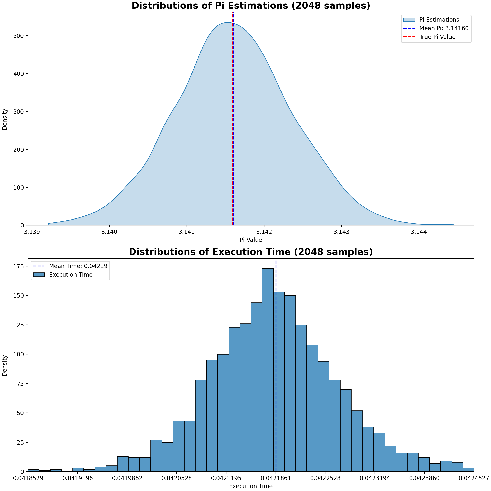

# Course Topics

- Why experimental design
- Introduction to data visualization
- Measuring performance and energy
- Profiling

---

# Plot Example - Intro

In the following slides, you will be shown a series of plots; mainly taken from the PPN course reports of previous students.

For each plot:

- Try to understand what is represented
- Explain what you observe
- Give a **definitive** conclusion from the data shown

Raise your hands when ready to propose an explanation.

# Plot Example (1)

{ width=100% }

---

# Plot Example (2)

{ width=80% }

---

# Plot Example (3)

{ width=100% }

---

# Plot Example (4)

{ width=100% }

---

# Plot Example (5)

{ width=100% }

---

# Plot Example (6)

{ width=100% }

---

# Plot Example (7)

{ width=100% }

---

# Plot Example - Summary

In the scientific community, data is all we have: if we can't trust data, we can't trust anything.

- Plots are made to backup scientific claims
  - If a plot raises suspicions, the author will lose thrust
- Plots are made to explain (to other) complex phenomenon:
  - A plot should be readable, formatted to expose what needs to be understood, and easy to isolate.
- Plots are made to help (us) understand complex phenomenon:
  - A plot must have a purpose, and be designed to answer a specific question(s)

---

# Common errors - Lacking Context

Data is often dependant on context:

- Execution time depends on CPU, memory (type and quantity), GPU
- Method hyperparameters (Which algorithm ? How many layers ? With/without pre-processing ?)
- What software versions ? (Compiler, libraries, OS, etc.)

---

# Common errors - Providing Context

## Good {.example}

We ran our experiments on a 13th Gen Intel(R) Core(TM) i7-13850HX CPU @5.30 GHz, 32KB/2MB/30MB:L1/L2/L3 15GB DDR5.
Compiler is `G++ 14.3.1`. 
We use version `v4.6.0` of the LightGBM library. Unless stated otherwise; we fit 200 trees using the GBDT method with max depth of 80 and 20 min samples per leaf.

## Bad {.alert}

Ces performances sont mesurées sur plusieurs runs d’environ 1000 données

---

# Common errors - Misleading plots

Good guideline: a plot purpose should be understandable in ~10 seconds

- Axis should be clear, labelled, with units
- Plots should use commonplace, field dependent formats
  - Strong scaling plots: # threads on X axis, speedup on Y, ideal speedup curve (Identity Function)
  - Weak scaling plots: # Threads | Problem Size on X Axis, speedup on Y, ideal speedup curve (1 constant)
  - Convergence plots: Number of epochs on X axis, error on Y
- Metrics used should be clear and common
- Beware of log scale, low # of data points, etc.

---

# Common Errors - Plot Example

{ height=90% }

# Common Errors - Bad Experimental Design

A plot 