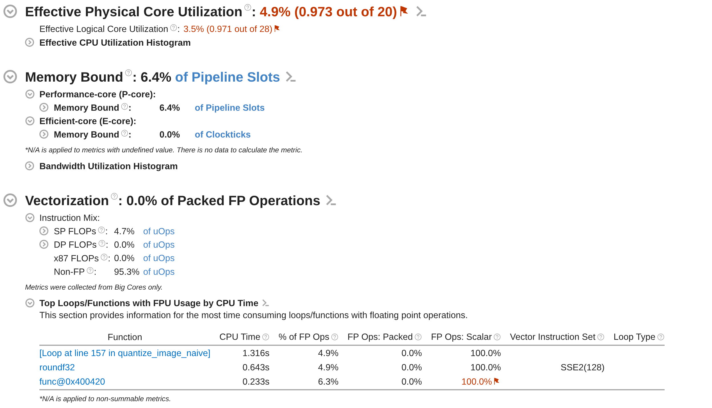

# Experimental Design, Profiling, and Performance/Energy Optimization

<div class="mkdocs-only" markdown>
  <p align="right" markdown>
  [Download as slides 📥](slides/lecture4.pdf)
  </p>
</div>


## Plot Example - Intro

In the following slides, you will be shown a series of plots; mainly taken from the PPN course reports of previous students.


For each plot:

- Try to understand what is represented
- Explain what you observe
- Give a **definitive** conclusion from the data shown

Raise your hands when ready to propose an explanation.

## Plot Example (1)

{ width=100% }

<div class="mkdocs-only" markdown>
  **PPN Example** - (No Caption)
</div>

## Plot Example (2)

{ width=80% }

<div class="mkdocs-only" markdown>
  **PPN Example** - (No Caption)
</div>


## Plot Example (3)

{ width=100% }

<div class="mkdocs-only" markdown>
  **PPN Example** - (No Caption)
</div>


## Plot Example (4)

{ width=100% }

<div class="mkdocs-only" markdown>
  **PPN Example** - "Récapitulatif des optimisations faites"
</div>


## Plot Example (5)

{ width=100% }

<div class="mkdocs-only" markdown>
  **PPN Example** - "Nouveau tracé de la latence cache"
</div>


## Plot Example (6)

{ width=100% }

<div class="mkdocs-only" markdown>
  **Prof Example** - (KNM): (a) Speedup map of GA-Adaptive (7k samples) over the Intel MKL hand-tuning for `dgetrf` (LU), higher is better. (b) Analysis of the slowdown region (performance regression). (c) Analysis of the high speedup region. $3,000$ random solutions were evaluated for each distribution.
</div>


## Plot Example (7)

{ width=100% }

<div class="mkdocs-only" markdown>
  **Prof Example** - (SPR): Geometric mean Speedup (higher is better)  against the MKL reference configuration on `dgetrf` (LU), depending on the sampling algorithm. 46x46 validation grid. 7k/15k/30k denotes the samples count. GA-Adaptive outperforms all other sampling strategies for auto-tuning. With 30k samples it achieves a mean speedup of $\times 1.3$ of the MKL dgetrf kernel.
</div>


## Plot Example - What makes a good plot

Ask yourself:

- What do I want to communicate ?
- What data do I need ?
- **Is my plot understandable in ~10 seconds ?**
- Is my plot self-contained ?
- Is the context, environment, and methodology clear ?


## Plot Example - Summary

HPC is a scientific endeavour; data analysis and plotting are essential.

- Plots drive decisions
- Plots make results trustworthy
- Plots explain complex behaviors

Datasets are large, multi-disciplinary, and often hard to reproduce.

# Experimental Methodology

## Experimental Methodology - Workflow

{ width=100% }


## Statistical significance - Introduction

Computers are noisy, complex systems:

- Thread scheduling is non deterministic -> runtime varies between runs.
- Dynamic CPU frequency (Turbo/Boost)
- Systems are heterogeneous (CPU/GPU, dual socket, numa effects, E/P cores)
- Temperature/thermal throttling can alter runtime

How can we make sure our experimental measurements are reliable and conclusive?


## Statistical significance - Warm-up effects

Systems need time to reach steady-state:

{ width=100% }

**On a laptop**: $\mathrm{Mean} = 0.315\ \mathrm{ms},\ \mathrm{CV} = 13.55\%$  

We need "warm-up" iterations to measure stable performance and skip cold caches, page faults, frequency scaling.


## Statistical significance - Noise mitigation

Noise can only be mitigated:

- Stop all other background processes (other users)
- Stabilize CPU Frequency (`sudo cpupower -g performance`)
    - Make sure laptops are plugged to avoid powersaving policies
- Pin threads via `taskset`, `OMP_PLACES` and `OMP_PROC_BIND`
- Consider hyperthreading
- Use stable compute nodes

Meta-repetitions are essential to mitigate noisy measurements.

## Statistical significance - Example

Same experiment on a stabilized benchmarking server:

{ width=100% }

**On a laptop:** $\mathrm{Mean} = 0.315\ \mathrm{ms},\ \mathrm{CV} = 13.55\%$  
**Stabilized node:** $\mathrm{Mean} = 0.582\ \mathrm{ms},\ \mathrm{CV} = 1.14\%$

### Note {.example}
  Timing on a laptop is always subpar


## Statistical significance - Mean, Median, Variance

Single-run measurements are misleading; we need statistics.

- Mean runtime $\bar{x} = \frac{1}{n}\sum_{i=1}^{n}x_i$
- Median: less sensitive to outliers than the mean
- Variance/standard deviation: Measure of uncertainty
- Relative metrics are useful: Coefficient of variation ($CV = \frac{\sigma}{\bar{x}} \times 100 \%$)

We usually give both the mean and standard deviation when giving performance results.
Plots usually show $\bar{x} \pm 1 \sigma$ as a shaded region around the mean to represent uncertainty.

### Note {.example}
  Distribution plots can be useful: stable measurements are often close to Gaussian, 
  even if systematic noise may lead to skewed or heavy-tailed distributions.


## Statistical significance - Confidence Intervals

How to decide how many repetitions we should perform ?

- Usually, the costlier the kernels, the less meta-repetitions are expected
- Short or really short kernels should have more metas to reduce the influence of noise

Remember that:

$$CI_{0.95} \approx \bar{x} \pm 1.96 \cdot \frac{\sigma}{\sqrt{n}}$$

More repetitions increase confidence, but returns diminish:  
CI width $\propto \tfrac{1}{\sqrt{n}}$

### Note {.example}
  Confidence intervals are a bit less common in plots than $\pm 1 \sigma$ but can also be used !


## Statistical significance - p-score & Hypothesis testing

In HPC, mean/median and variance often suffice, but hypothesis testing can become handy in some contexts.

- Null hypothesis ($H_0$): GPU and CPU have the same performance for small matrixes
    - Differences in measurements are **only** due to noise
- Alternative hypothesis: CPU is faster for small matrixes

- **p-value** is the probability that $H_0$ explains a phenomenon.
- If $p < 0.05$, we can safely reject $H_0$ (Statistically significant difference)

Example:
$\bar{x}_{GPU} = 5.0 \mathrm{s}$, $\sigma_{GPU} = 0.20$,
$\bar{x}_{CPU} = 4.8 \mathrm{s}$, $\sigma_{CPU} = 0.4$,
Two-sample t-test with 10 samples $p = 0.02$.

The measured differences between CPU and GPU execution time are **statistically significant**.


## Experimental Methodology – Reproducibility

Reproducibility is a very hot topic (Reproducibility crisis in science):

- **Data and protocols are first-class citizens**: as important as the plots themselves  
- **Transparency** matters: make data, scripts, and parameters accessible  
- Enables others to **verify, build on, and trust your results**


### Note {.example}
  Beware of your mindset: your results should be credible and honest before being "good".
  
  "Our results are unstable, we have yet to understand why, this is what we tried"
  is a completely valid answer

# Plotting Tools

## Plotting tools - Cheetsheet

| Name       | Use                                  |
|------------|--------------------------------------|
| pandas     | Storing and saving tabular data      |
| numpy      | Numerical arrays, manipulating data  |
| matplotlib | Basic 2D plots, full control         |
| seaborn    | Statistical plots, higher-level API  |
| logging    | Logging experiment progress/results  |
| OpenCV     | Image processing, animations/videos  |
| ffmpeg     | Generating and encoding videos       |

Lookup the quick reference plotting gallery in the annex!  
Both `matplotlib` and `seaborn` provide extensive online galleries.


[**Live Example of the matplotlib gallery <https://matplotlib.org/stable/gallery/index.html>**]


## Plotting tools - Matplotlib

Matplotlib is one of the most widely used plotting libraries.  
A figure is built hierarchically from nested elements:

```
- Figure (The canvas)
  - (Subfigures)
    - Axes (One or more subplots)
      - Axis (x/y/z scales, ticks, labels)
      - Artists (Lines, markers, text, patches, etc.)
```

- Data is plotted using axis-level functions like `ax.plot`, `ax.histogram`
- Customization occurs at both the Figure and Axes levels
- Complex multi plots layout occur at the Figure level

## Plotting tools - Matplotlib


## Plotting tools - Matplotlib

```python
import matplotlib.pyplot as plt

x = [0, 1, 2, 3]
y = [2.8, 5.7, 12.5, 14]

# Create a new figure, single axis
# Size is 8 inches by 8 inches, and constrained layout
fig, ax = plt.subplots(figsize=(8, 8), layout="constrained")

# Plot a simple line
ax.plot(x, y, color="red", label="My Algorithm")

# Customize the axes
ax.set_xlabel("Iteration") # Name of the X axis
ax.set_ylabel("Time (s)") # Name of the y axis
# Title of the plot
ax.set_title("Evolution of Time with the number of iteration")

ax.margins(0, 0) # Remove white spaces around the figure
ax.legend(loc="upper right") # Draw the legend in the upper right corner

fig.savefig("my_plot.png", dpi=300) # Higher DPI -> bigger image
plt.close() # End the plot and release resources
```

## Plotting tools - Matplotlib (Multi axis)

We can easily have multiple plots on the same figure:

```python
nrows = 5, ncols = 1
fig, axs = plt.subplots(5, 1, figsize(8 * ncols, 3 * nrows))

ax = axs[0]
ax.plot()
...

ax = axs[1]
ax.plot()
...

fig.tight_layout() # Alternative to constrained layout
fig.savefig("my_multiplot.png", dpi=300)
```

Each axis is its own plot, with its own legend and artists.

### Note {.example}

Use the reference (<https://matplotlib.org/stable/api/index.html>) and gallery (<https://matplotlib.org/stable/gallery/index.html>) extensively !

## Plotting tools - Seaborn

Seaborn is an extension of Matplotlib dedicated to statistical visualization:

{ width=40% }

It's useful for histograms, bar charts, kdeplots, scatterplots, and is overall a very good companion library.

## Plotting tools - Seaborn


```python
import matplotlib.pyplot as plt
import seaborn as sns
import pandas as pd
import numpy as np

df = pd.read_csv(...) # Read the dataframe from somewhere

fig, ax = plt.subplots(figsize=(8, 8), layout="constrained")

# We must pass the axis to plot on as an argument
sns.kdeplot(data=df, x="Time", label="Algorithm", color="red", fill=True, ax=ax)

ax.set_title("Distribution of Execution time for the algorithm")
ax.margins(0, 0)
ax.set_xlabel("Time (s)", fontweight="bold")
ax.set_ylabel("Density", fontweight="bold")

ax.set_xticks(np.linspace(df["Time"].min(), df["Time"].max(), 10)
# Format the x axis ticks: `3.25s`
ax.xaxis.set_major_formatter(StrMethodFormatter("{x:.2f}s"))

fig.savefig("my_distribution.png")
```

<https://matplotlib.org/stable/gallery/ticks/tick-formatters.html>

# Profiling

## Profiling - Motivation

- HPC codes are massive, complex and heterogeneous
- Humans are **bad** at predicting bottlenecks 
- Don’t blindly optimize everything
- Profiling guides optimization

Remember: **Always profile first**.

## Profiling - Amdahl's law

$$
\mathrm{Speedup} = \frac{1}{1 - f + \frac{f}{S}}
$$

Where f is the fraction of program improved, and S is the speedup on that fraction.

Example:

- I have optimized 80% of my application, with a speedup of x10
- In total, my application is now $\frac{1}{0.2 + (0.8 / 10)} = 3.57 \times$ faster

The 20% are a bottleneck !

## Profiling - Steps

1. Where (Hotspots) ?
  - What functions are we spending time/energy in ?
  - What **call-tree** are we spending time/energy in ?
2. Why ?
  - Arithmetic density, memory access patterns
  - Cache misses, branch misspredictions, vectorization efficieny (Hardware counters)
3. What goal ?
  - Should I optimize for speed ? For energy ? Memory footprint ?
    - What about cold storage size/compression ?
  - Do I have constraints (i.e. limited memory) ?
  - Should I optimize or switch algorithm ?


## Profiling - Time

It's rather easy to benchmark a single function using a (high-resolution monotonic) clock:
```python 
begin = time.now()
my_function()
end = time.now()
elapsed = end - begin
```

Very simple way to evalute a function cost

## Profiling - Time (Stability)

But we have to account for noise:

```python
for _ in range(NWarmup):
  my_function()

times = []
for _ in range(NMeta):
  begin = time.perf_counter()
  my_function()
  times.append(time.perf_counter() - begin) 

median = np.median(times)
std = np.std(times)
print(f"Time: {median} +/- {std}")
```

We must check that our measures are valid !

## Profilers - Introduction

Full application -> Thousands of functions to measure !

- Profilers are tools to automate this
- Two main types:
  - Sampling: Pause the program and log where the program is
  (Costly functions -> More samples !)
  - Instrumentation: Modify the program to automatically add timers

Profilers can also check for thread usage, vectorization, memory access, etc.

## Perf - Record

Linux Perf is a powerful and versatile profiler:

```bash
perf record -g -- python3 ./scripts/run_bls.py kepler-8
[ perf record: Woken up 255 times to write data ]
[ perf record: Wrote 85.474 MB perf.data (1220354 samples) ]

pert report perf.out
```


It's a great tool to quickly get a Tree stack without any dependencies.

## Profiling - Hardware counters

In reality, perf is not realy a profiler !

- The Linux Perf API can be used to access many hardware counters
- Perf record is just one usage of perf

Most CPUs/GPUs have hardware counters that monitors different events:

- Number of cycles
- Number of instructions
- Number of memory access
- RAPL

## Profiling - Perf for Hardware counters

```bash
perf stat -e cycles,instructions python3 ./scripts/run_bls.py kepler-8
{'period': 3.520136229965055, 'duration': 0.11662673569985234, 'phase': 0.43, 'depth': 0.004983530583444806, 'power': 0.028861678651344452}

 Performance counter stats for 'python3 ./scripts/run_bls.py kepler-8':

   962,187,248,452      cpu_atom/cycles/                                                        (43.66%)
 1,119,319,677,606      cpu_core/cycles/                                                        (56.34%)
 3,547,146,665,075      cpu_atom/instructions/           #    3.69  insn per cycle              (43.66%)
 2,837,633,772,530      cpu_core/instructions/           #    2.54  insn per cycle              (56.34%)

      12.507192456 seconds time elapsed
```

## VTune

The Intel VTune profiler is more complex but more self-contained than perf:


## VTune - CPU Usage


## VTune - HPC Performance

VTune has multiple collection mode:



## Other profilers

- MAQAO is a profiler developped by the LIPARAD
- AMD, NVIDIA and ARM have their own profilers for their platforms
- And many, many others (likwid, gprof, etc.) 

Usually, we combine a "quick" profiler like gprof/perf record with a more indepth one when needed.

## Profiling - Energy

Energy is a growing concern:

- One HPC cluster consume millions of dollars in electricity **yearly**
- ChatGPT and other LLM are computationally intensive:
  - Nvidia GPUs consumes lots of energy

On the flip side, measuring energy is harder than measuring time.

Many actors still focus on execution time only -> Energy is perceived as "Second rank"

## Profiling - RAPL

Running Average Power Limit (RAPL) is an x86 hardware counter that monitors energy consumption:

- Energy is tracked at different level
  - Core, Ram, Package, GPU, etc.
- It does not account for secondary power consummers (Fans, Water cooling, etc.) 
- RAPL is not event based: The entire machine is measured ! (Background processes, etc.)

It requires sudo permissions to access (compared to a clock)

```bash
perf stat -a -j -e power/energy-pkg,power/energy-cores <app>
{"counter-value" : "88.445740", "unit" : "Joules", "event" : "power/energy-pkg/", "event-runtime" : 10002168423, "pcnt-running" : 100.00}
{"counter-value" : "10.848633", "unit" : "Joules", "event" : "power/energy-cores/", "event-runtime" : 10002166697, "pcnt-running" : 100.00}
```

## Profiling - Watt-Meter


Hardware solutions are also available to monitor energy consumption.
They typically have a slow sampling resolution ($\approx 1s$) and are harder to scale to entire clusters.

On the flip side, they give precise power measurements compared to RAPL.

## Profiling - RAPL accuracy


In practice, RAPL underestimates power consumption, but trends are correctly matched.

# Live Demo

## Experiment example

[Annex/run_experiment.sh](https://m1-chps.github.io/glhpc/annex/example_experiment/run_experiment/)

[Annex/model_convergence.py](https://m1-chps.github.io/glhpc/annex/example_experiment/model_convergence/)


