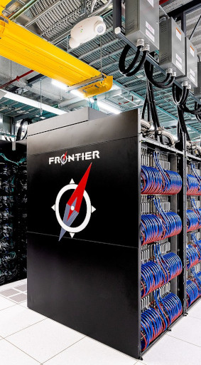

# HPC for AI & Environmental impact of computation

<div class="mkdocs-only" markdown>
  <p align="right" markdown>
  [Download as slides 📥](slides/lecture5.pdf)
  </p>
</div>

# Introduction to AI applications

## AI Renaissance: Neural Networks

- 2012: **AI renaissance** brought by increased data
    availability and computation ressources
  - breakthroughs in multiple domains
  - many innovations: algorithms, specialized processors, optimizations

- Most systems use **neural networks**:

  - Training (stochastic gradient descent + backpropagation)
  - Inference (forward pass)

- For both, **the bottleneck is matrix multiplication**

## Objectives

* Explain why dense linear algebra (GEMM) dominates NN compute
* Core SGEMM kernel ideas and common optimizations
* Use Roofline model to identify bottlenecks
* Understand mixed precision & quantization tradeoffs for energy/perf

## SGEMM

Single-precision General Matrix-Matrix multiplication (SGEMM):

$$ RES = A \times B + C $$


## Naive SGEMM implementation (pseudocode)

```c
// Initialize RES to C
for (i = 0; i < M; i++)
    for (j = 0; j < N; j++)
        RES[i][j] = C[i][j];

// Matrix multiply
for (i = 0; i < M; i++) {
    for (j = 0; j < N; j++) {
        for (k = 0; k < K; k++) {
            RES[i][j] += A[i][k] * B[k][j];
        }
}
```

- FLOPS: $2 \times M \times N \times K$
- Memory: $4 \times (M \times K + K \times N + M \times N)$ bytes

## Locality issues in naive SGEMM

$$
{\color{green}\text{order in memory} \rightarrow}
$$

$$
\begin{bmatrix}
\color{red} b_{11} & b_{12} & b_{13} & b_{14} \\
\color{red} b_{21} & b_{22} & b_{23} & b_{24} \\
\color{red} b_{31} & b_{32} & b_{33} & b_{34} \\
\color{red} b_{41} & b_{42} & b_{43} & b_{44} \\
\end{bmatrix}
$$

- Stride in accessing B (column-major)
  - Poor spatial locality
  - Difficult to vectorize
  - Cache misses for large matrices (reuse distance too large)

- **Low arithmetic intensity**: $\approx 0.5$ FLOP/byte for large matrices

## Reordering loops (i,k,j)

- Sums `RES[i][j] += A[i][k] * B[k][j];` are independent → reorder loops:

```c
for (i = 0; i < M; i++) 
    for (k = 0; k < K; k++) 
        for (j = 0; j < N; j++) 
            RES[i][j] += A[i][k] * B[k][j];
```

- `A[i][k]` does not depend on `j` → load once, reuse N times

- `RES` and `B` accesses are now stride-1 (row-major)

```c
for (i = 0; i < M; i++) 
    for (k = 0; k < K; k++) {
        const float temp = A[i][k];
        for (j = 0; j < N; j++) 
             RES[i][j] += temp * B[k][j];
        }
```

- Better spatial locality and easier to vectorize

## Vectorization

Inner loop assembly for (i,k,j) ordering with AVX (8 `float` in a vector):

```asm
.loop:                                   # Inner loop
    vmovss  xmm0, DWORD PTR A[i][k]      # Load A[i][k]
    vbroadcastss ymm0, xmm0              # Broadcast scalar to all lanes
    vmovaps ymm1, YMMWORD PTR B[k][j]    # Load B[k][j:j+8]
    vfmadd231ps ymm2, ymm1, ymm0         # Fused multiply-add
    vmovaps YMMWORD PTR RES[i][j], ymm2  # Store RES[i][j:j+8]
    add     j, 8                         # Increment j by 8 (vector width)
    cmp     j, N                         # Compare j with N
    jl      .loop                        # Loop if j < N
```

## Problems with (i,k,j) ordering

- Temporal locality analysis:
  - **GOOD**: $A[i][k]$ reused in the inner loop, reuse distance $1$.
  - **MEDIUM** : For a fixed $(i,j)$, each $RES[i][j]$ revisited once per k. So reuse distance $K$ (one full row).
    - To keep RES in cache between uses you would need cache $\ge K \times 4B$
  - **BAD** : For a fixed $(k,j)$, $B[k][j]$ used once per i. So reuse distance $K \times N$ (entire B matrix).
    - To keep B in cache between uses you would need cache $\ge K \times N \times 4B$

- Still poor temporal locality for large matrices 

- Solution: **tiling / blocking** to increase reuse

## Blocking (tiling)

- **Idea:** operate on sub-matrices blocks that fit in cache

$$ 
\begin{bmatrix}
\textcolor{red}{A_{11}} & A_{12} \\
A_{21} & A_{22} \\
\end{bmatrix}
\times
\begin{bmatrix}
\textcolor{blue}{B_{11}} & B_{12} \\
B_{21} & B_{22} \\
\end{bmatrix}
=
\begin{bmatrix}
\textcolor{red}{A_{11}}\textcolor{blue}{B_{11}} + A_{12}B_{21} & A _{11}B_{12} + A_{12}B_{22} \\
A_{21}B_{11} + A_{22}B_{21} & A_{21}B_{12} + A_{22}B_{22} \\
\end{bmatrix}
$$

```c
#define BS 64 // Block size
// Loop over blocks
for (ii = 0; ii < M; ii += BS)
    for (kk = 0; kk < K; kk += BS)
        for (jj = 0; jj < N; jj += BS)

            // Operate on blocks A[ii:ii+BS, kk:kk+BS],
            // B[kk:kk+BS, jj:jj+BS], RES[ii:ii+BS, jj:jj+BS]
            for (i = ii; i < min(ii+BS, M); i++)
                for (k = kk; k < min(kk+BS, K); k++)
                    for (j = jj; j < min(jj+BS, N); j++)
                        RES[i][j] += A[i][k] * B[k][j];
```

## Parallelization

- Each block operation is independent → parallelize over blocks

```c
#pragma omp parallel for collapse(3)
for (ii = 0; ii < M; ii += BS)
    for (jj = 0; jj < N; jj += BS)
        for (kk = 0; kk < K; kk += BS)
            // Block multiplication as before
```

- Each thread works on its own block → no false sharing
- Synchronization only at the end of the parallel region
- NUMA considerations: pin threads to cores, allocate memory close to threads
- Load balancing: static scheduling usually works well for large matrices


## Libraries & autotuners

- Highly optimized SGEMM implementations exist:

  - OpenBLAS, Intel MKL for CPU

  - NVIDIA cuBLAS for GPU

- Implementations use blocking, vectorization, parallelization, and many architecture-specific optimizations

- Libraries are carefully tuned for different sizes and shapes of matrices.

- Autotuners (e.g., ATLAS, TVM, **MLKAPS**) can generate optimized code for specific hardware and problem sizes.

## Roofline model - Definitions

- Hypothesis: performance is limited by either compute or memory bandwidth

  - performance: FLOP/s (vertical axis)
  - memory bandwidth: Bytes/s
  - arithmetic intensity: FLOP/byte (horizontal axis)

- Simple visual model to understand bottlenecks

## Roofline model - Bounds


- *Compute bound*: horizontal line at peak FLOP/s
- *Memory bound*: sloped line with slope = memory bandwidth
  - $\frac{\text{Flop/s}}{\text{Flop/Byte}} = \text{Byte/s}$ 

## Roofline model - SGEMM analysis


- Interactive demonstration and analysis

# Environmental impact of computation

## Introduction

- **Major ecological crisis**: French roadmap targets carbon
    neutrality in 2050 (Stratégie Nationale Bas Carbone).

- Requires a **40% energy consumption reduction**.

- HPC **part of the solution**: modeling and improving complex
    systems

- HPC **part of the problem**: Frontier system at ORNL

  - More than $10^{18}$ floating point operations per second

  - Consumes **21MW**: the energy of a small town ($16\,000$ french houses)



## Environmental impact of computation

- The ICT sector consumes **$\approx$ 5% of the energy**
    wordwide

- It accounts for **1.8% - 2.8%** of emitted GHG \[Freitag, 2021\]:

  - Accounts for embodied emissions.

  - Shadow energy during the **whole life-cycle: mining, fabrication, transportation, recycling**.

- GHG emmissions are only one of the sustainability issues

  - rare-earth mining and waste disposal (eg. Agbogbloshie).

    - human-right abuses, health issues, pollution.

- **This presentation focus on energy consumption of HPC**


## What about renewable energies?

- Low-carbon electricity is a **limited ressource**

- Decarbonation $\rightarrow$ huge increase in electricity demand

    - Heating, Transportation, Industry

    - Computing will compete for low-carbon electricity.


# Energy consumption of HPC

## Evolution of processing units \[Batten, 2023\]


## Dennard's scaling 1970-2005 


$$\begin{aligned}
        \text{CMOS Power} &  & P = \underbrace{1/2.C.V^2.f}_{P_{\text{dynamic}}} + \underbrace{V.I_{\text{leak}}}_{P_{\text{static}}}
\end{aligned}$$

For each generation, transistors dimensions reduced by **30%**,

- Voltage and capacitance reduced by 30%

- Frequency increases: $\times 1.4 \approx 1/0.7$

- Surface halved: $0.5 \approx 0.7 \times 0.7$

- Power halved: $\Delta P = 0.7 \times 0.7^2 \times 1/0.7 \approx 0.5$

**Power per surface unit remains constant** but manufacturers
double number of transistors and frequency increases:

- Power efficiency doubles every 1.57 years

- Total power increases

## Multicore 2005-2020

- At current scale, leak currents start increasing
    ($P_{\textrm{static}} \nearrow$). **Power wall slows Dennard's scaling.**

- Computing demand $\rightarrow$ **parallelism** and **specialization**.

- Number of cores increases exponentially since 2005.

- Power efficiency still improving:

    - selectively turning-off inactive transistors;

    - architecture design optimizations;

    - software optimizations.


## AI Accelerators 2020-2024

- For domain specific applications, such as AI, specialized
    accelerators are used

    - Memory and compute units tuned for a specific problem (matrix
        multiplication) ;

    - Faster and better power efficiency: GPU, TPU, FPGA, ASIC.


## Analysis of TOP-100 HPC systems


**Efficiency and Peak computation exponential increase.**

## Rebound effects

- In 1865, Jevons shows that steam engine improvements translate into
    increased coal consumption.

- In HPC, efficiency gains contribute to the rising computation
    demand.

    1.  **net increase of the total power consumption.**

- Rebound effects for data-centers \[Masanet, 2020\]

    1.  6% increase in energy consumption from 2010 to 2018\
        (255 % increase in nodes).

- **Indirect rebound effects**: computation advances can
    contribute to the acceleration of other fields.


# AI energy and computation costs


## Training cost doubles every 3.4 months \[OpenAI, 2020\]


## Should we study training or inference?

- **Training**: huge cost but done once

    - GPT3, 175 billion parameters, $\approx$ 314 ZettaFLOP

    - GPT4, 1.7 trillion parameters

- **Inference**: millions of users and requests

    - 80-90% cost of a deployed AI system is spend on inference
        \[NVIDIA, 2019\]

## Inference cost - Diminishing returns for computer vision


Exponential increase in compute for linear accuracy gain \[Desislavov,
2023 / Schwartz, 2019\]


# More frugal computing?

## Smaller precision / Smaller models for AI


LLM success of smaller models (Llama, Chinchilla) fine-tuned
for specific tasks with LoRA.


## Tradeoff: Model complexity - Cost - Explainability

- Inference cost grows with model complexity

- Simpler models are often more interpretable

    - Traditional science also prefers simpler models

- DNN not necessary for all tasks


## DVFS study of LU decomposition


- Knights Mill 72 cores

- Intel MKL dgetrf

- $n \in [1000,3000]$

- RAPL estimation


Save energy by computing slower: 1GHz

Thomas Roglin, M1 UVSQ/INTEL internship 2023


## When accounting for the whole system


- Model: RAPL + **40W**

- **Optimal 2.6 GHz**: compute faster and turn off machine

- Saves idle power (race to idle)

Thomas Roglin, M1 UVSQ/INTEL internship 2023
 
## Need for an interdisciplinary discussion

- AI / HPC can contribute towards sustainability (eg. acceleration of
    weather forecast models) ...  **but its energy cost must be reduced**

- **Efficiency:**

    - Improve hardware and software

    - Use smaller models / smaller precision

    ... **subject to rebound effects**

- **Frugality in computing:**

    - Balance computation cost vs. outcomes for each task

    - Choose the right sized model

    - Assess the environmental impact


## Exemple: e-health solution in Tanzania \[d'Acremont, 2021\]

Treatment of febrile children illnesess in dispensaries.

- **IMCI:** Paper-based decision tree WHO

- **e-POCT** CART tree tailored to real data on a standalone
    tablet

    - Final CART tree easy to interpret and manually checked

    - Randomized-trial $\rightarrow$ better clinical outcomes and
        antibiotic prescription reduction

- Sophisticated AI that continuously collects patient data and adapts
    the algorithm ?

    - Increase in hardware and computation costs.

    - Loss in explainability and verification of the algorithm.

## References - HPC for AI applications

- [S. Boehm Optimizing, How to Optimize a CUDA Matmul Kernel](https://siboehm.com/articles/22/CUDA-MMM)

## References - Environmental impact of computation 
- Jones, Nicola (2018) ‘How to stop data centres from gobbling up the world’s electricity’. Nature, 561(7722), pp. 163–167.

- Freitag, Charlotte, Berners-Lee, Mike, Widdicks, Kelly, Knowles, Bran, et al. (2021) ‘The real climate and transformative impact of ICT: A critique of estimates, trends, and regulations’. Patterns, 2(9), p. 100340. [online](https://www.sciencedirect.com/science/article/pii/S2666389921001884)

- Masanet, Eric, Shehabi, Arman, Lei, Nuoa, Smith, Sarah and Koomey, Jonathan (2020) ‘Recalibrating global data center energy-use estimates’. Science, 367(6481), pp. 984–986.

- Schwartz, Roy, Dodge, Jesse, Smith, Noah A. and Etzioni, Oren (2019) ‘Green AI’. [arXiv:1907.10597](http://arxiv.org/abs/1907.10597)

- Amodei, Dario, Hernandez, Danny, Sastry, Girish, Clark, Jack, et al. (2018) ‘AI and compute. OpenAI’. [https://openai.com/blog/ai-and-compute/](https://openai.com/blog/ai-and-compute/)

- D'Acremont presentation: <https://youtu.be/oKcy_cY0QOw>